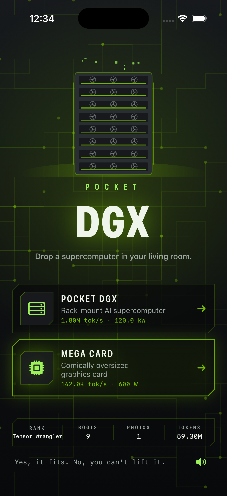
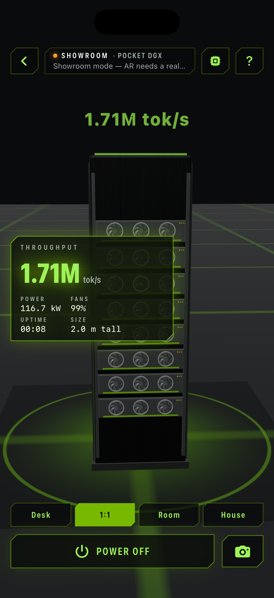
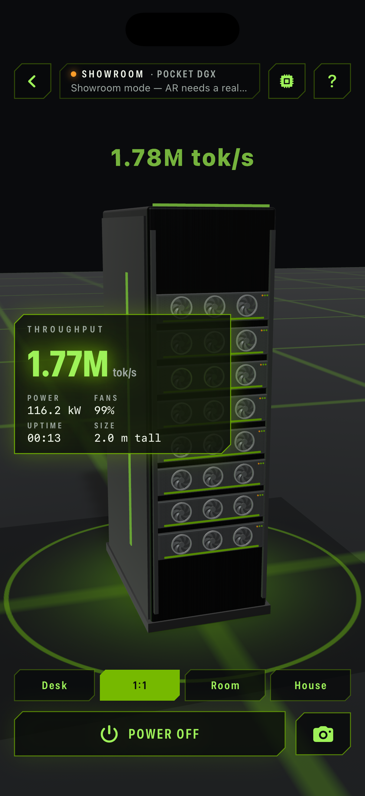
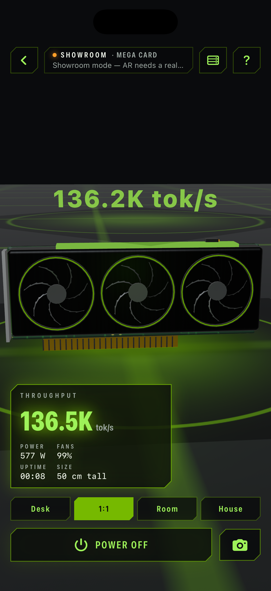
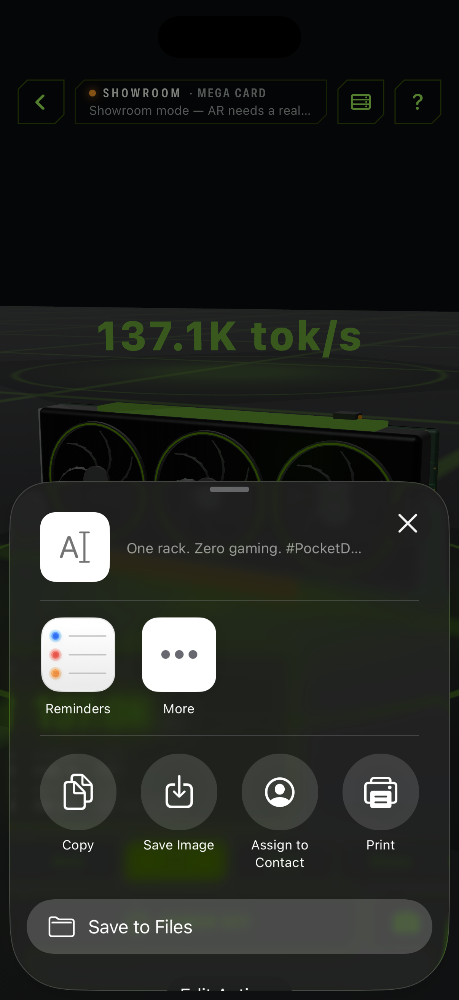

# Pocket DGX

A native, portrait iPhone AR toy. Drop a life-size, glowing rack-mount AI
supercomputer, or a comically oversized graphics card, into your living room
with ARKit and RealityKit. Walk around it, tap it to power it on, watch the
fans spin and the LEDs pulse green while a holographic tokens/sec counter
floats above, scale it from desk-size to house-size, and share a photo.
Every mesh, texture, chime and the icon is generated in code: no 3D assets,
no bundled audio, no network, no accounts, no third-party dependencies.

It is an NVIDIA-*inspired* fan project: signature green on charcoal, circuit
traces, and plenty of CUDA/tensor/wafer in-jokes. It contains no NVIDIA logos,
marks or imagery and no likeness of any person.

## Use

Pick **Pocket DGX** (the rack) or **Mega Card** on the title screen.

- On a device with ARKit, aim at the floor; the rig lands on the first detected
  horizontal plane. Tap the floor to move it. On the Simulator or a device
  without AR, a **showroom** viewer with a slow idle orbit is used instead so the
  app always demos; drag to orbit, tap empty space to pause the orbit.
- **Tap the rig** or the big **Power** button to boot it. A boot sequence
  scrolls, fans spin up, LEDs pulse and the hologram switches to live tokens/sec.
  Tap again to shut it down.
- **Desk / 1:1 / Room / House** presets or a pinch rescale it; a two-finger
  rotation turns it. Telemetry shows throughput, power draw, fan speed,
  uptime and real-world height.
- The **camera** button captures the RealityKit frame with a caption and opens
  the system share sheet.
- Swap rig with the top-right button, **?** shows the controls, and the speaker
  toggle on the title screen mutes the synthesized audio.

Boots, photos, total tokens generated, largest scale and your rank (Intern up to
Wafer Baron) persist locally.

## Build and run

Requirements: macOS, Xcode with an iOS Simulator runtime, XcodeGen (`brew install
xcodegen`). Deployment target iOS 17.0; portrait iPhone. No third-party runtime
dependencies or signing required for Simulator.

```sh
cd ios-pocket-dgx
xcodegen generate
xcodebuild -project PocketDGX.xcodeproj -scheme PocketDGX \
  -sdk iphonesimulator -configuration Debug \
  -derivedDataPath DerivedData CODE_SIGNING_ALLOWED=NO build
```

Open the generated project in Xcode and run **PocketDGX** on an iPhone
Simulator. Alternatively install `DerivedData/Build/Products/Debug-iphonesimulator/PocketDGX.app`
with `xcrun simctl install booted ...` and launch `studio.pocketdgx.app`.
AR placement needs a physical device with your own signing configuration; the
Simulator falls back to the showroom viewer automatically.

The checked-in project is generated from `project.yml`. Regenerate it after
changing target configuration. Recreate the original icon with
`swift Scripts/MakeIcon.swift` from this directory.

## Checks

```sh
swift test
xcrun swift-format lint --strict --recursive App Core Tests Scripts Package.swift
```

The pure-Swift `Core` module holds the rig simulation (power state machine,
boot/shutdown timing, fan spin-up, LED pulse, synthetic throughput and power
curves), scale presets and snapping, rack layout constants, boot-log lines,
number formatting and persisted stats/rank. Tests cover power transitions and
timing, throughput ramp, 50 ms frame-delta capping, fan and LED ranges, scale
snapping, layout fit, boot sequencing, formatting and stats round-tripping.
Rendering lives in the app target: procedural PCB/brushed-metal/grille textures,
a custom fan mesh, unlit emissive LEDs, an AVAudioEngine synth for the fan hum,
boot chime, shutter and whooshes, and UIKit haptics.

## Screenshots

Captured from the iPhone Simulator with `xcrun simctl io booted screenshot`.






