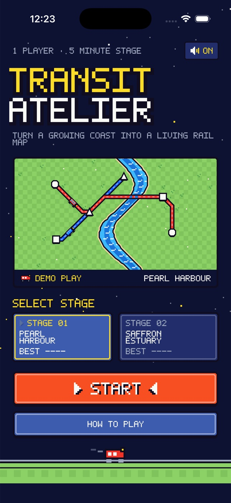

# Transit Atelier



A native, offline iPhone transit game presented as an 8-bit overworld. Turn a growing coastal city into a living diagram: draw lines, carry passengers to matching shapes, build interchanges and keep stations from overcrowding.

## Build and run

Requires macOS, Xcode 16 or newer (validated with Xcode 26.6), and XcodeGen 2.46.0. No signing, accounts, backend, dependencies or proprietary assets are needed for Simulator play.

```sh
cd ios-transit-atelier
brew install xcodegen # only if missing
xcodegen generate
xcodebuild -project TransitAtelier.xcodeproj -scheme TransitAtelier \
  -sdk iphonesimulator -configuration Debug \
  -derivedDataPath DerivedData CODE_SIGNING_ALLOWED=NO build
open TransitAtelier.xcodeproj
```

Select an iPhone Simulator in Xcode and Run. Minimum iOS 17, portrait orientation. The generated project is included; `project.yml` is its source of truth.

## Checks

```sh
swift format lint --strict --recursive Sources Tests Scripts Package.swift
swift test
```

The shared simulation is dependency-free Swift, tested on macOS through SwiftPM. Deterministic checks cover boarding/delivery, interchanges, conservation during redraw, tunnel limits, congestion, growth/upgrades, save restoration and invalid routes. Native UI must also be tested in iOS Simulator.

## Play

- Choose **Stage 01 Pearl Harbour** or **Stage 02 Saffron Estuary**, then **START** (or **CONTINUE** a saved run).
- Select a colored line. Tap station shapes in order, or drag from one station to another. The clock starts with the first connected pair.
- Trains shuttle automatically. Tiny shapes beside stations are passenger destinations; matching shapes are delivered. Connected lines allow transfers.
- Tap a new station to extend the selected line. **UNDO** removes the last stop; **CLEAR** clears the line after confirmation. A redraw safely returns passengers aboard to their last station.
- River-crossing segments consume tunnels. You begin with two lines, one six-seat train per line and three tunnels.
- Every 50 simulation seconds the clock pauses and a **POWER UP READY** ribbon appears. Tap it to choose more seats, more tunnels, or another line and locomotive (up to four). The map stays available to inspect and edit before opening the choices.
- New stations appear every 28 seconds. At 12 waiting passengers a station flashes red and a danger bar begins filling. Carry passengers away before 24 seconds of overcrowding end the run.
- Deliver as many passengers as possible before the five-minute closing time. Use 1× / 2× speed and **PAUSE**/**PLAY**; paused maps remain editable. **MENU** opens a pixel panel with instructions, sound and **SAVE & QUIT**; the clock stops while it is open.
- Results offer **PLAY AGAIN**, **STAGES**, **VIEW MAP**, and native **SHARE** of an actual result card with the achieved score.

## Persistence and lifecycle

Best delivered counts are saved separately for each city. Active runs save after edits, upgrades, periodically and when backgrounded. **SAVE & QUIT** returns to the title; **CONTINUE** resumes paused. Backgrounding automatically pauses without advancing the simulation. Starting a new journey intentionally replaces the saved active run.

Synthesized, original square-wave chiptune feedback uses the ambient audio session and respects silent mode. Sound preference persists. Haptics run where supported. Reduced Motion disables blinking, stepped sprite frames and delivery flashes; train movement remains essential game information.

## Scope

Two designed maps, twelve stations per map, four destination shapes, procedural passenger demand and a condensed five-minute challenge. This is an original small V1 inspired by transit-network puzzles; it is not a reproduction of the reference game's full feature or map catalog. Local bests only. Portrait iPhone layouts; no iPad-specific layout, localization, cloud sync or App Store submission is included. Audio and haptic perception should be checked on hardware.

## Artwork

All maps, tiles, sprites, panels and UI are drawn with native SwiftUI Canvas and shapes in an original NES-inspired palette. Text is rendered from an in-app 5×7 bitmap font (`PixelFont` in `Sources/App/Theme.swift`); no system or third-party typefaces, and no serifs, are used. Animations are stepped (two-frame sprites, blinking prompts) rather than eased. The original icon can be regenerated on macOS:

```sh
swift Scripts/MakeIcon.swift Resources/Assets.xcassets/AppIcon.appiconset/AppIcon.png
```
