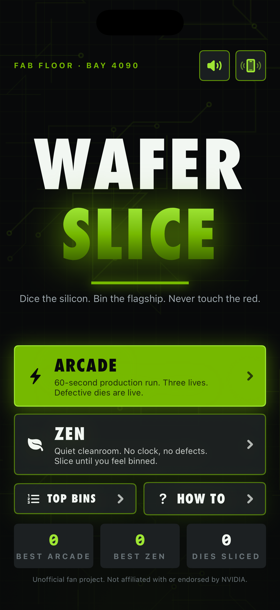
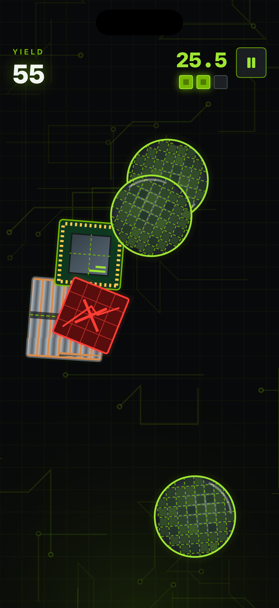
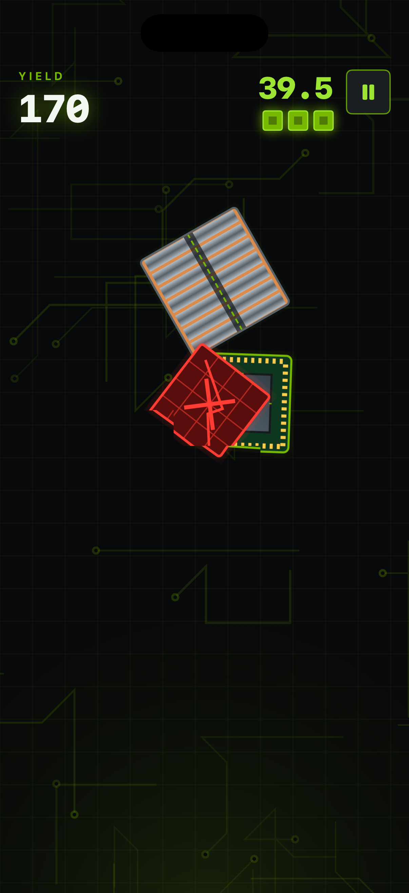
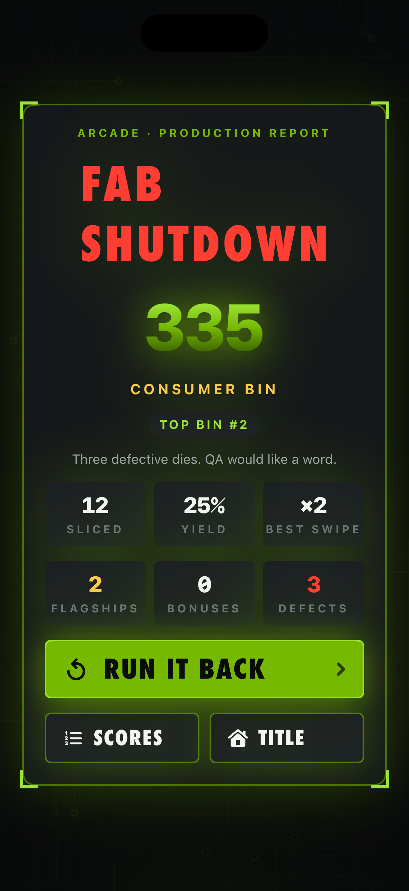
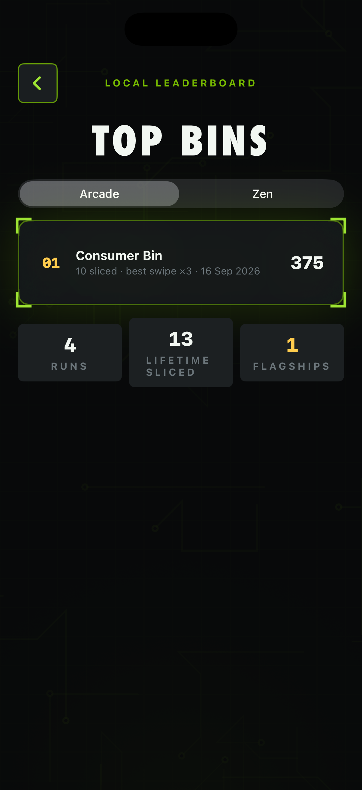
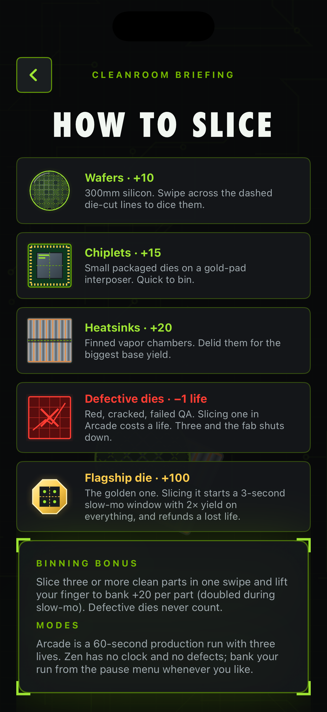

# Wafer Slice

A native, portrait iPhone slicer set on a fab floor. Silicon wafers, packaged
chiplets and finned heatsinks are launched into the cleanroom; swipe across their
dashed die-cut lines to dice them for yield. SwiftUI presents the title, HUD,
pause, results, leaderboard and briefing screens; SpriteKit renders the blade,
physics, polygon splitting, particles and screen shake. All art is procedural,
all audio is synthesized with `AVAudioEngine`, and nothing touches the network.

Wafer Slice is an unofficial NVIDIA-inspired fan project: bright green on
charcoal, PCB traces, neon glow and a lot of GPU vocabulary. It contains no
NVIDIA logos, marks or licensed imagery and no likeness of any person.

## Play

Pick **Arcade** (a 60-second production run with three lives) or **Zen** (no clock,
no defects, bank whenever you like from the pause menu). Drag a finger across
parts to slice them:

| Part | Yield | Notes |
| --- | --- | --- |
| Wafer | +10 | 300 mm silicon with a die grid |
| Chiplet | +15 | Packaged die on a gold-pad interposer |
| Heatsink | +20 | Finned vapor chamber |
| Defective die | −1 life | Red, cracked, failed QA. Arcade only |
| Flagship die | +100 | Golden. Starts a 3.2 s slow-mo with 2× yield and refunds a lost life |

Slice three or more clean parts in one swipe and lift your finger for a
**binning bonus** (+20 per part, doubled in slow-mo). Defective dies never count
toward a bonus, and three defects shut the fab down. Runs are graded into bins
(Engineering Sample through Founders Edition) and the top ten per mode, plus
lifetime totals, persist locally in `UserDefaults`. Sound and haptics can be
toggled from the title or pause screens; Reduce Motion disables screen shake and
trims particles.

## Build and run

Requirements: macOS, Xcode with an iOS Simulator runtime, XcodeGen (`brew install
xcodegen`). Deployment target iOS 17.0; portrait iPhone. No third-party
dependencies or signing required for the Simulator.

```sh
cd ios-wafer-slice
xcodegen generate
xcodebuild -project WaferSlice.xcodeproj -scheme WaferSlice \
  -sdk iphonesimulator -configuration Debug \
  -derivedDataPath DerivedData CODE_SIGNING_ALLOWED=NO build
xcrun simctl install booted DerivedData/Build/Products/Debug-iphonesimulator/WaferSlice.app
xcrun simctl launch booted studio.waferslice.game
```

The checked-in project is generated from `project.yml`; regenerate it after
changing target configuration. Recreate the icon with `swift Scripts/MakeIcon.swift`
from this directory (it writes `App/Assets.xcassets/AppIcon.appiconset/AppIcon.png`).

## Checks

```sh
swift test
xcrun swift-format lint --strict --recursive App Core Tests Scripts Package.swift
```

`Core/` is a UIKit-free Swift package (`WaferSliceCore`) holding the rules
(`GameSession`), deterministic wave director (`LaunchDirector`), polygon
geometry (`Geometry`) and persistence model (`HighScoreBoard`). The 28 tests
cover segment/circle hits, polygon splitting, seeded randomness, Arcade timeout
and life loss, binning bonuses, defective handling, flagship slow-mo and life
refunds, pause/resume, grading, launch bounds and JSON round-trips.

## Layout

- `App/` – SwiftUI shell (`RootView`), `GameStore` view model, `GameScene`
  (SpriteKit), `BladeTrail`, `ProceduralArt`, `Synth`, `Haptics`.
- `Core/` – pure Swift rules, geometry and scores.
- `Tests/` – XCTest suite for the Core module.
- `Scripts/MakeIcon.swift` – renders the app icon procedurally.
- `Screenshots/` – Simulator captures embedded below.

## Screenshots

| Title | Gameplay | Flagship slow-mo |
| --- | --- | --- |
|  |  |  |

| Results | Leaderboard | How to play |
| --- | --- | --- |
|  |  |  |
