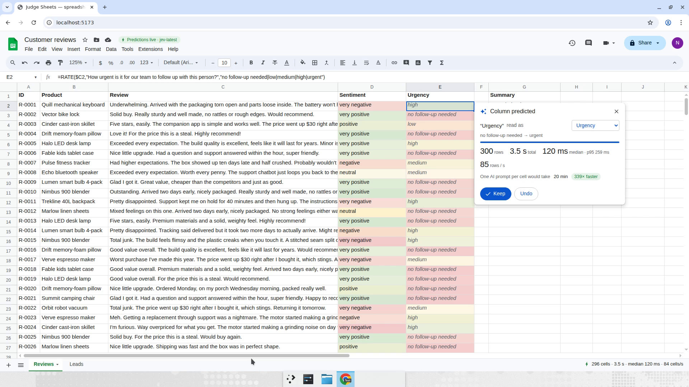
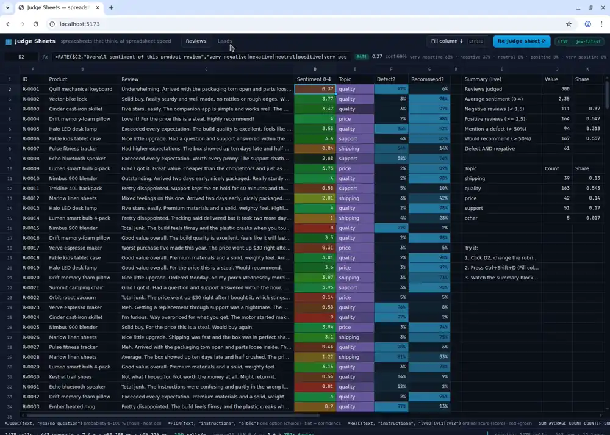

# Judge Sheets — predictive spreadsheets

A Google-Sheets-lookalike spreadsheet (own virtualized grid, own formula engine) where
**typing a column header predicts the column**. Type `Urgency`, `Topic`, `Mentions a
defect?` or `Ready to buy?` in an empty header next to a text column and, as you type,
[TypeSafe Jev](https://docs.typesafe.ai) reads your intent; on Enter the whole column fills
with semantic predictions — 300 rows in ~3.5 s. No formulas, no prompts, no add-on
sidebar.





## The problem

Every formula in a spreadsheet recalculates the instant you touch it — except the ones
about *meaning*. "Is this review negative?", "what does this lead want?", "does this
mention a defect?" still mean an intern, a brittle
`=IF(ISNUMBER(SEARCH("broken",C2)),"defect","")`, or an "AI in sheets" add-on that runs an
LLM prompt per cell at 3–10 s each (20 minutes for a 300-row column) and returns text you
still have to parse. Nobody iterates on a rubric when each iteration costs five minutes.

Jev answers a typed question in ~100–150 ms and takes many questions about one text in
one request, so a column of 300 rows predicts in a few seconds and the summary block
built on it (`COUNTIF`, `AVERAGE`) recalculates as answers stream in.

## Keystroke intent

1. You type in an empty header cell (row 1) to the right of a text column.
2. After 120 ms of quiet, one `choice` request goes to Jev with the header text plus three
   sample rows from the text column; it picks one of 14 prediction schemas (sentiment,
   urgency, topic, intent, buying intent, tone, priority, star rating, defect?, recommends?,
   refund risk?, spam?, free-form yes/no, free-form low/high). A chip under the cell shows
   the interpretation, its probability and the measured latency (`Urgency · 91% · 72 ms`).
3. On Enter the column is filled with the schema's formula for every data row — the same
   `=JUDGE / =PICK / =RATE` formulas from the engine, so the formula bar still shows exactly
   what each cell is doing and power users can edit it.
4. A *Column predicted* card shows the live run: rows done, wall time, median / p95
   request latency, rows per second and the "one AI prompt per cell" baseline. **Keep**
   commits the column; **Undo** clears it; the dropdown re-interprets the header with a
   different schema (cache makes re-tries cheap).

## How Jev is used

All TypeSafe calls live in `server/jev.ts` (the browser never sees the API key). The
formula engine (`src/engine/`) treats `JUDGE/PICK/RATE` as ordinary functions whose
value is asynchronous:

| Formula | Jev primitive | Returns | Rendered as |
|---|---|---|---|
| `=JUDGE(text, "yes/no question")` | `noul` | probability 0–1 | `Yes · 97%`, red/green tint |
| `=PICK(text, "instructions", "a\|b\|c")` | `choice` | the chosen option | label, category colour, tint = confidence |
| `=RATE(text, "instructions", "lvl0\|lvl1\|lvl2\|lvl3")` | `score` | expected level | level label, red→green by score |

1. On each recalculation tick the workbook collects every dirty Jev cell into a `JevSpec`
   `(kind, text, instructions, options)`.
2. `batchSpecs()` groups specs by **source text**: all questions about one review go in
   ONE `systemone` request as fan-out (`state` = the review, `questions` = one per column).
3. The proxy runs requests through a 12-lane pool (`JEV_CONCURRENCY`), streams answers back
   as NDJSON as they arrive, and retries 429/529/5xx and stalled connections with
   exponential backoff + jitter.
4. Answers are cached by `(kind, text, instructions, options)`: re-interpreting a header
   you tried before, or editing unrelated cells, costs zero requests.
5. Cells depending on judged cells recompute through the normal dependency graph as
   answers land.

Schemas and their exact Jev questions are in `src/lib/predict.ts`; e.g.

```
Urgency          → RATE  "How urgent is it for our team to follow up with this person?"  no follow-up needed|low|medium|high|urgent
Intent           → PICK  "This is an inbound message to a B2B software company. What does the sender want?"  pricing|demo request|support|partnership|job inquiry|spam
Mentions a defect? → JUDGE "Does the text report a defect, damage or malfunction of the product itself?"
Ready to buy?    → RATE  "How strong is the sender's intent to purchase our product?"  no interest or unrelated|curious, just exploring|actively evaluating|ready to buy now
```

The intent classifier itself is one `choice` question over the 14 schema descriptions,
with the header and sample rows as `state`.

## Measured run (real API, `jev-latest`, 12 concurrent lanes, Linux VM)

| Scenario | Rows | Wall time | p50 | p95 | Throughput | Per-cell LLM @ 4 s |
|---|---|---|---|---|---|---|
| Header intent chip (header + 3 samples, 1 request) | — | 72–132 ms | | | | |
| Type `Urgency` in E1 → Enter (Reviews, 300 rows) | 300 | 3.5–5.2 s | 114–120 ms | 259–379 ms | 57–85 rows/s | 20 min (230–339× faster) |
| Type `Mentions a defect?` in F1 (Reviews, 300 rows) | 300 | 4.7 s | 151 ms | 390 ms | 64 rows/s | 20 min |
| Type `Ready to buy?` in F1 (Leads, 150 rows) | 150 | 1.9 s | 116 ms | 237 ms | 78 rows/s | 10 min (313× faster) |
| Open workbook (2 pre-predicted columns) | 450 | 5.9–6.8 s | 102–129 ms | | 66–75 rows/s | 30 min |

Variance comes from the API's tail latency: p50 is stable, but occasionally a request
stalls; it is aborted after 2.5 s and retried, and the footer counts it as a retry.
Everything shown in the card and the footer is measured in the run you are looking at.

Judgment quality checked by hand: reviews mentioning a broken part get 93–98 % on
*Mentions a defect?* while clean positive reviews sit at 2–3 %; leads with approved budget
asking for a quote land on *ready to buy now*, hiring and spam messages on *no interest*;
furious reviews about a defect get *urgent*/*high* urgency, happy ones *no follow-up needed*.

## Run it

```sh
cd judge-sheets
npm ci
export TYPESAFE_API_KEY=...      # server-side only; never reaches the browser
npm run dev                      # proxy on :8787 + Vite on :5173
```

Open http://localhost:5173, wait a few seconds for the two seeded columns to predict, then
click the empty header **E1** on *Reviews*, type `Urgency` (watch the chip), press Enter.
Try `Topic`, `Would recommend?`, `Refund risk?`, or any yes/no question of your own; on
*Leads* try `Ready to buy?` or `Spam?`.

Normal spreadsheet things still work: double-click / F2 to edit, formula bar, drag the fill
handle, Ctrl+Shift+D fill-down, drag column borders to resize, `SUM/AVERAGE/COUNTIF/IF/...`.

`MOCK=1 npm run dev` replays deterministic answers without an API key; the title-bar badge
says **Mock mode — replayed answers**. Without a key and without `MOCK=1` the proxy answers
503 and the badge says **No API key — set TYPESAFE_API_KEY**.

```sh
npm test          # vitest: parser, dependency graph, fill-down, batching, metrics, intent → formula
npm run lint      # oxlint --deny-warnings src server
npm run typecheck
npm run build     # tsc -b && vite build
```

## Layout

```
server/index.ts    node:http proxy: /api/health, /api/judge (NDJSON stream), pool, mock
server/jev.ts      the only module that talks to api.typesafe.ai; timing + backoff
server/types.ts    typed question builders: noul(), choice(), score()
src/engine/        tokenizer, parser, evaluator, workbook (dep graph, dirty set, Jev cache)
src/lib/predict.ts schema catalog, header-intent question, header → formula
src/lib/store.ts   predictions (ghost column, keep/undo), JevRunner binding
src/data/          seeded generators (mulberry32) + workbook definition
src/ui/            Grid (virtualized), Chrome (Sheets-style bars), SmartFill card + chip
```
