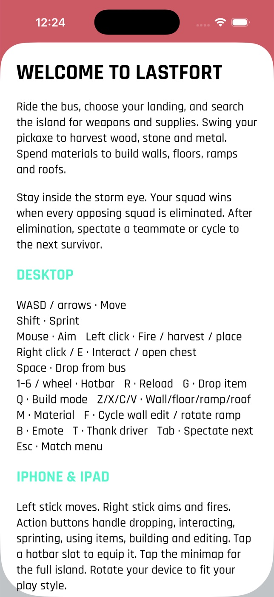

# Lastfort



Lastfort is an original top-down battle-royale shooter with building. Up to
16 players drop from a sky bus onto a deterministic 1000 × 1000 island,
harvest wood, stone and metal, loot weapons and consumables, build and edit
forts, and outlast the storm. Solo, duos and squads share an authoritative
Dart server; bots fill empty slots. The native Apple client includes the
lobby, locker, season pass, career statistics, settings, spectating, results
and rematches.

The client uses SwiftUI, native Canvas, AppKit keyboard/mouse input, and
UIKit touch/haptic support. macOS 14+, iOS 17+ and iPadOS 17+ are supported.
There is no Flutter runtime or embedded web UI. The former web and Android
clients have been retired as part of this Apple migration.

```
apple/
  Lastfort.xcodeproj      checked-in native Xcode project and shared schemes
  project.yml            XcodeGen source
  Sources/App/           native screens, design system (Theme.swift), artwork, renderer and input
  Sources/Model/         typed protocol, prediction, networking and persistence
  Resources/             app icon, launch colours and generated catalogue/fixtures
  Tests/                 Swift model, deterministic-world and live protocol tests
core/                    unchanged pure Dart rules, simulation, world and bots
server/                  unchanged authoritative Dart WebSocket server
test/multiplayer-e2e.sh   shell-driven native WebSocket integration
test/historical-flutter/ archived former framework-specific harness
PROTOCOL.md              existing JSON-over-WebSocket contract
```

## Requirements

- Xcode 26 (verified with 26.6), including arm64 and x86_64 iOS Simulator
  slices. Deployment targets remain iOS 17 and macOS 14.
- Dart 3.13 for the existing backend lockfiles (validated with 3.13.0).
- XcodeGen 2.46 if regenerating the project; it is not required to build the
  checked-in project. `brew install xcodegen`.

## Start the multiplayer server

```sh
cd lastfort/server
dart pub get --enforce-lockfile
dart run bin/server.dart --host 0.0.0.0 --port 8787
```

The default client URL is `ws://localhost:8787/ws`. On physical iPhones and
iPads, set the Mac's LAN address in Settings, such as
`ws://192.168.1.10:8787/ws`, and allow local network access when prompted.
For remote servers use `wss://`. The server also accepts `--fast`, `--seed N`
and `--quiet`; `/health` reports rooms and connections.

## Build and run native apps

All commands below run from the repository root:

```sh
open lastfort/apple/Lastfort.xcodeproj

xcodebuild -project lastfort/apple/Lastfort.xcodeproj \
  -scheme Lastfort-macOS -configuration Debug -destination 'platform=macOS' \
  -derivedDataPath lastfort/apple/build/mac CODE_SIGNING_ALLOWED=NO build
open lastfort/apple/build/mac/Build/Products/Debug/Lastfort.app

xcodebuild -project lastfort/apple/Lastfort.xcodeproj \
  -scheme Lastfort-iOS -configuration Debug \
  -destination 'generic/platform=iOS Simulator' \
  -derivedDataPath lastfort/apple/build/ios CODE_SIGNING_ALLOWED=NO build
```

For interactive use, choose `Lastfort-iOS` and an iPhone or iPad simulator
in Xcode and press Run. Both device families and portrait/landscape layouts
are supported; narrow landscape uses compact HUD and touch controls.
To install the built app on an already booted simulator:

```sh
xcrun simctl install booted \
  lastfort/apple/build/ios/Build/Products/Debug-iphonesimulator/Lastfort.app
xcrun simctl launch booted com.lastfort.lastfort
```

For physical devices, select a signing team in Xcode and build with signing
enabled. The bundle ID remains `com.lastfort.lastfort`. The macOS app has
sandbox/network-client entitlements. Both targets include local-network
privacy text and an ATS development policy allowing configurable insecure
LAN endpoints. Use secure endpoints and narrow the policy when distributing
against a fixed production service.

## Multiplayer and controls

Create a room with a mode, optional seed and fast timers, or enter another
player's room code. Ready up; the host chooses the bot-filled player count
and launches. Menus retain server autopilot controls. The server is the
authority for loot, combat, building, storms, eliminations and results;
the native client predicts movement and reconciles acknowledged inputs.

| Action | macOS | iPhone/iPad |
|---|---|---|
| Move / sprint | WASD/arrows / Shift | left stick / Sprint |
| Aim / fire | mouse / left button | right stick; outward deflection fires |
| Jump / bus drop | Space | Jump / Drop from bus |
| Interact / chest | E or right button | Interact |
| Build mode | Q | Build |
| Piece | Z/X/C/V | piece chips |
| Material | M | material button |
| Place / edit | left button / F | Place / Edit menu |
| Hotbar | 1–6 / mouse wheel | hotbar slots |
| Reload / drop item | R / G | Reload / Drop item |
| Use consumable | select slot and fire | Use |
| Spectate next | Tab | Next |
| Emote / thank driver | B / T | Emote / Thank |
| Menu / island map | Esc / minimap | Menu / minimap |

The HUD includes shield/health, inventory, resources, ammo, compass,
storm timer, minimap/full map, squad and elimination information.
Light/dark/system appearance, reduced motion, sound and haptic settings
persist. Previous Apple `shared_preferences` profile keys migrate when the
same app container is available; resume tokens move to the device Keychain.
Subsequent tokens are stored per server, never in profile JSON.

Connection errors are visible. A dropped connection retries with backoff
(eight failures, then manual reconnect) using one current WebSocket
generation. The server retains a disconnected player for about 60 seconds.
iOS backgrounding disconnects and foregrounding resumes. Expired rooms
return a visible error instead of leaving a stale match screen.

## Launch configuration

Use Xcode scheme environment variables, process environment, or
`--key=value` arguments. Arguments override environment values:

| Environment | Argument | Meaning |
|---|---|---|
| `LASTFORT_SERVER` | `--server=ws://…/ws` | endpoint |
| `LASTFORT_NAME` | `--name=Scout` | display name |
| `LASTFORT_ROOM` | `--room=NATIVE` | create/join a known code |
| `LASTFORT_MODE` | `--mode=squads` | solo/duos/squads |
| `LASTFORT_SEED` | `--seed=4242` | deterministic new-room seed |
| `LASTFORT_FAST` | `--fast=true` | shorter new-room timers |
| `LASTFORT_AUTO` | `--auto=true` | server autopilot |
| `LASTFORT_AUTOSTART` | `--autostart=2` | host starts after N human clients join |
| `LASTFORT_THEME` | `--theme=dark` | initial appearance |
| `LASTFORT_TEST` | `--test=run-id` | isolated profile/token namespace and reports |

For macOS, launch the executable directly to supply environment/arguments:

```sh
lastfort/apple/build/mac/Build/Products/Debug/Lastfort.app/Contents/MacOS/Lastfort \
  --server=ws://localhost:8787/ws --name=MacScout --room=NATIVE
```

For simulators use `SIMCTL_CHILD_LASTFORT_SERVER=… xcrun simctl launch …`
or pass `--server=…` after the bundle ID.

## Validation

```sh
# From repository root:
swift test --package-path lastfort/apple
xcrun swift-format lint --strict --recursive \
  lastfort/apple/Sources lastfort/apple/Tests lastfort/apple/Tools \
  lastfort/apple/Package.swift
dart format --output=none --set-exit-if-changed lastfort/apple/Tools/export_assets.dart
(cd lastfort/core && dart analyze && dart test)
(cd lastfort/server && dart analyze && dart test)
bash lastfort/test/multiplayer-e2e.sh
```

The fixture tests compare three island seeds against authoritative Dart
terrain, POIs, structures, chests and resource nodes. Other tests validate
snapshot decoding, exact sparse input fields, structure removal by ID,
prediction acknowledgements, profile migration and result reward idempotency.
The live test starts the actual Dart server and uses two native
`URLSessionWebSocketTask` clients to join a room, play with bots, send actions,
disconnect/resume the same player, compare final summaries, and rematch.
It does not drive or validate the UI. With plain `swift test`, that one test
is skipped unless `LASTFORT_TEST_SERVER` points at a running server.
The wrapper accepts `DART`, `LF_PORT` and `LF_OUT`; logs go to ignored
`lastfort/test/output/`. Existing Dart test suites remain intact.

Native UI, visual parity, real-device touch input and signed distribution
must be checked separately on macOS/iPhone/iPad. No UI-driven verification
is claimed by the protocol tests.

## Regenerate native artifacts

```sh
dart run lastfort/apple/Tools/export_assets.dart
swift lastfort/apple/Tools/generate_icon.swift
xcodegen generate --spec lastfort/apple/project.yml
```

The catalogue and fixtures are generated from `core/`; they are not demo
snapshots used by the app. The UI uses the system sans-serif (SF) with a
condensed heavy display style and monospaced digits; there are no bundled
fonts or bitmap key art. The lobby backdrop is the actual island for the
room's seed, rendered from `core`'s deterministic terrain, and cosmetic shapes
are drawn with native Canvas from the palette/shape catalogue.
