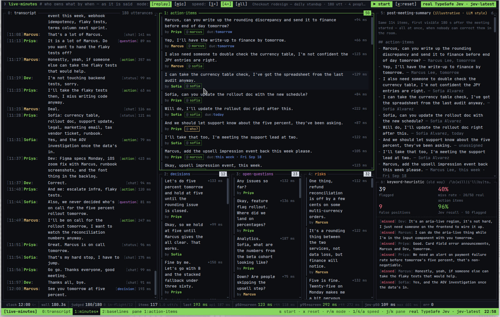
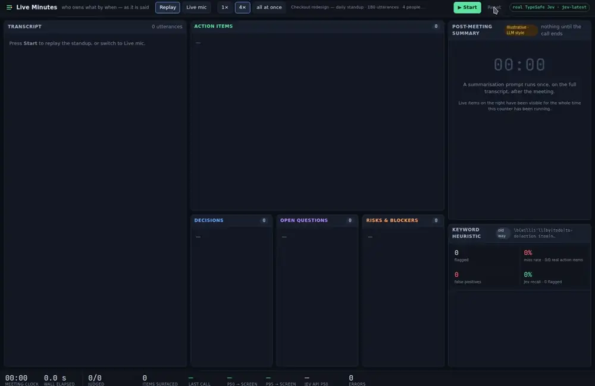

# Live Minutes

**Who owns what by when — as it is said.**





## The problem

Meeting-notes tools produce action items *minutes after the call ends*: they wait for the full
transcript, run one big summarisation prompt, then parse the prose. By the time "Marcus owns the
rounding write-up by tomorrow" shows up, Marcus has left the call and nobody can say "no, Sofia
took that".

Live Minutes judges **every finished sentence as it is spoken**. Each utterance becomes one
[TypeSafe](https://typesafe.ai) Jev request that answers seven independent questions at once,
and the card lands in the Action items / Decisions / Open questions / Risks list about **150 ms
after the sentence ends** — while the speaker is still talking, so people can correct it in the room.

Why latency matters here: the value of an extracted action item decays with the distance from the
moment it was said. Inside ~200 ms it is a shared artefact the room can react to ("that's not what
I meant", click the `?` chip to fix the owner). Ten minutes later it is a diff somebody reviews alone.

## What is on screen

The UI is laid out like a tmux session: seven bordered panes labelled `0:transcript` … `6:keyword-heuristic`
(the active pane has a green border), a measured-metrics line, and a green status bar with the windows,
the active pane, the key bindings, the data source and a clock. Everything is keyboard-driven:

| key | action |
|---|---|
| `s` | start / stop |
| `x` | reset |
| `r` / `m` | replay / live mic |
| `1` / `4` / `a` | 1× / 4× / all at once |
| `j` / `k` | next / previous pane (or click a pane) |

| Pane | What it shows |
|---|---|
| **0:transcript** (left) | Speaker-labelled utterances with the kind Jev assigned and the round-trip latency of that call. |
| **1:action-items / 2:decisions / 3:open-questions / 4:risks** (centre) | Cards that appear as utterances are judged. Each card carries a **latency tag: measured end-of-utterance → card committed to the DOM**. Action items show an `@owner` chip, a resolved `due:` date, and a yellow `@who?` chip when Jev is not confident about the owner — click it to see the probability over attendees and fix it. Reversed decisions are struck through and marked *superseded*. Blocked status updates surface under Risks. |
| **5:post-meeting-summary** — illustrative, LLM style (top right) | The "old way": nothing until the meeting ends, a timer counting up, then the whole list at once. Labelled as illustrative; it reuses the live items, it does not run a summarisation prompt. |
| **6:keyword-heuristic** — old way (bottom right) | A keyword rule (`will`, `I'll`, `by`, `todo`, `action item`, `need to`, `should`, `can you`, …) applied to the same transcript, with its miss rate against the fixture's ground-truth labels, false positives, and the missed utterances. |
| **Metrics line** (above the status bar) | Meeting clock, wall elapsed, judged / in-flight, items surfaced, utterances/s, last call, **p50 / p95 end-of-utterance → on-screen**, browser round-trip, Jev API time (measured server-side), errors. Every number is measured. |

### Input modes

- **Replay** — a seeded, hand-written 12-minute, 4-person product standup (180 utterances: tangents, jokes, a
  half-decision that gets reversed, "I'll take that" without a name, "end of next sprint", a blocker on
  infra). Play at **1×**, **4×**, or **all at once** (180 parallel requests through a concurrency limiter).
- **Live mic** — Chrome's Web Speech API. Interim text is shown in the transcript, sentences are segmented
  in code (`src/lib/segment.ts`), and each complete sentence is judged. If the browser has no speech
  recognition the button explains why and Replay stays available.

## How Jev is used

One request per utterance (`server/jev.ts`), state:

```jsonc
{
  "today": "2026-09-17 (Thursday)",
  "current_sprint_ends": "2026-09-25",
  "launch_date": "2026-10-01",
  "attendees": [{ "name": "Priya Nair", "role": "Engineering Manager" }, ...],
  "speaker": "Priya Nair",
  "previous_3_utterances": [{ "speaker": "...", "text": "..." }, ...],
  "recent_decisions": ["..."],
  "utterance": "Marcus, can you write up the rounding discrepancy and send it to finance before end of day tomorrow?"
}
```

and seven questions fanned out in that single call:

| id | type | question |
|---|---|---|
| `kind` | choice | `action_item` / `decision` / `open_question` / `risk` / `status_update` / `chit_chat`, with explicit tie-breaks (accepting assigned work is an action item; an un-agreed proposal is a status update; bare agreement is chit-chat). |
| `assignee` | choice | each attendee by name + `speaker_themself` + `unassigned`. `speaker_themself` is resolved to the speaker in code. |
| `has_deadline` | noul | does the utterance set a due date *for the work* (dates mentioned as content don't count)? |
| `deadline_kind` | choice | `specific_date` / `this_week` / `next_sprint` / `before_launch` / `end_of_quarter` / `none` — resolved to a real date **in code** (`src/lib/deadline.ts`: weekday names, "tomorrow", "the 24th", "October 1st", sprint end, launch date, quarter end). |
| `reverses_earlier_decision` | noul | does this utterance itself undo a decision in `recent_decisions`? |
| `is_blocked` | noul | is the work stuck *right now* on another team / vendor / approval? |
| `importance` | score | 4-level legend, trivial → critical. |

Jev supplies only these judgments. Sentence segmentation, date arithmetic, owner resolution,
decision supersession, confidence gating (owner confidence < 0.6 → `?` chip), aggregation and all
metrics are plain TypeScript. The API key lives only in the Node proxy (`server/index.ts`), which
adds a 6 s per-attempt timeout and exponential backoff on 429 / 529 / 5xx.

## Run

Requires Node 22+ (uses `--experimental-strip-types`) and `TYPESAFE_API_KEY` in the environment.

```sh
cd live-minutes
npm ci
TYPESAFE_API_KEY=... npm run dev     # proxy on :8787 + Vite on :5173, one command
```

Open http://localhost:5173, press `4` then `s` (or click **[4×]** and **▶ start**).

- `MOCK=1 npm run dev` replays recorded answers from `server/mock-answers.json` (no key needed). The header
  badge turns amber and reads **MOCK · recorded answers**.
- `npm run eval` runs all 180 utterances against the real API at concurrency 12 and prints latency and
  accuracy against the fixture's ground truth. `npm run eval -- --write-mock` refreshes the mock recording.
- `npm test` · `npm run lint` · `npm run typecheck` · `npm run build`

## Measured

Real TypeSafe API (`jev-latest`), Linux VM, 2026-09-17. Fixture: 180 utterances, 50 labelled action items.

**Browser, 4× replay (screenshot above)**

| metric | value |
|---|---|
| items surfaced live | 117 of 180 utterances (50 action items, 12 decisions, 23 questions, 32 risks) |
| end-of-utterance → on-screen, p50 | **123 ms** |
| end-of-utterance → on-screen, p95 | 292 ms |
| browser round-trip p50 | 118 ms |
| Jev API time p50 (server-side) | 109 ms |
| errors | 0 |

**Browser, all at once** (180 requests, concurrency 12): 180 judged in 9.1 s (19.9 utt/s), 0 errors. The
→ screen latency then includes queueing behind the limiter, so it is reported but not the headline.

**`npm run eval`, accuracy vs. ground truth**

| metric | value |
|---|---|
| Jev latency p50 / p95 / max | 121 ms / 352 ms / 1.17 s |
| `kind` accuracy | 88.3 % (159/180) |
| action-item recall / precision | 96.0 % / 92.3 % |
| owner correct (action items) | 96.0 % (48/50) |
| deadline kind correct (action items) | 98.0 % (49/50) |
| reversal detection | 98.9 % (178/180) |
| blocked detection | 97.8 % (176/180) |
| **keyword heuristic**: action items missed | **40 %** (20/50), 9 false positives, precision 77 % |

Remaining `kind` confusions are mostly chit-chat ↔ status update on filler like "Sounds good, that's
enough for today" — none of them surface on the right-hand side.

## Layout of the code

```
server/index.ts      node:http proxy — /api/health, /api/judge, MOCK=1
server/jev.ts        state + question builders, retry/backoff, timings
scripts/dev.ts       spawns proxy + Vite
scripts/eval.ts      real-API evaluation against the labelled fixture
src/data/transcript.ts  the 180-utterance fixture with ground truth
src/lib/segment.ts   sentence segmentation for live mic
src/lib/deadline.ts  deadline_kind → date, in code
src/lib/resolve.ts   Jev answers → Judgment, confidence gating
src/lib/aggregate.ts lists, supersession, owner fixes, latency per item
src/lib/keyword.ts   the keyword baseline
src/lib/useMeeting.ts replay / mic orchestration, concurrency limit, metrics
src/components/*     Transcript, Lists, ItemCard, Baselines, Hud, Controls
```
