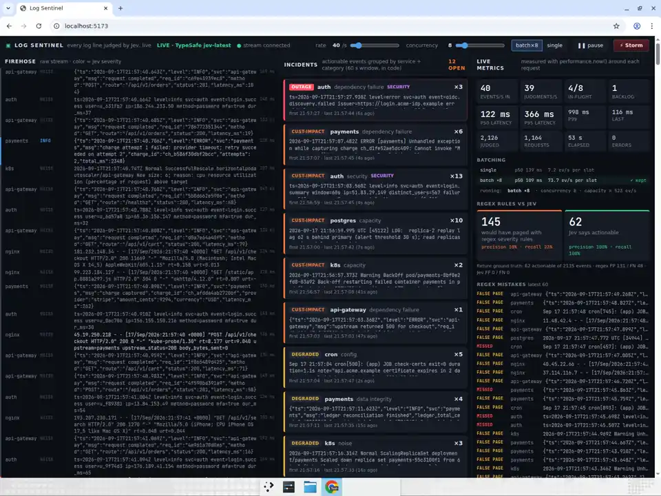
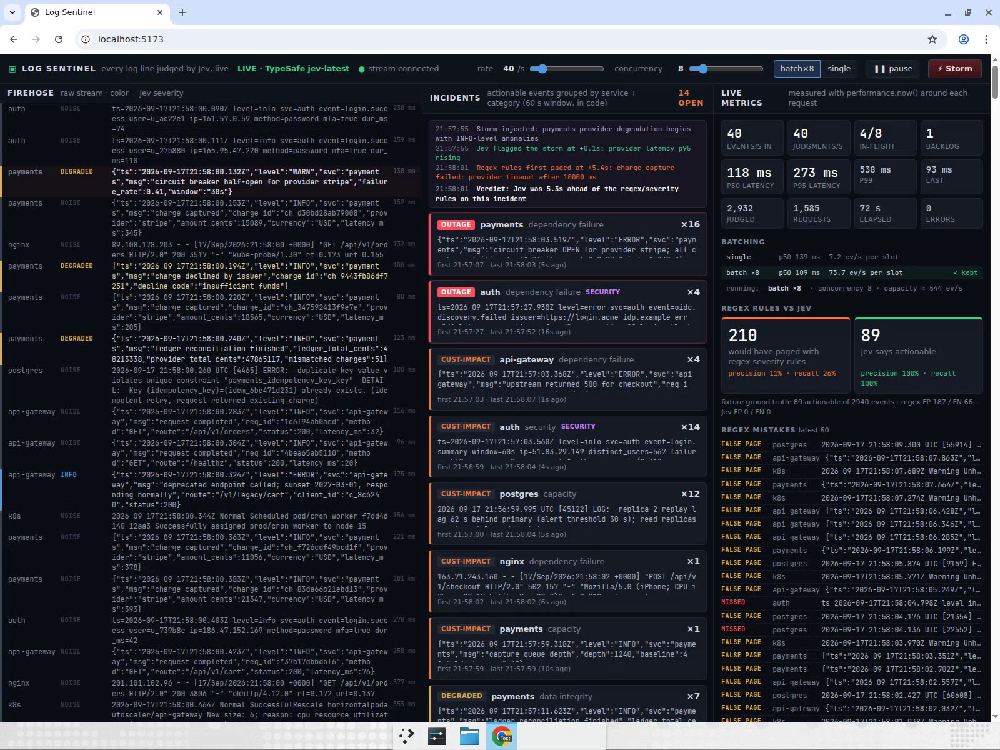

# Log Sentinel

Every log line on a live multi-service stream is judged by [TypeSafe Jev](https://docs.typesafe.ai) in ~100 ms
— *is this actionable, how severe, what category, is it security-relevant* — and compared, on screen, against the
regex + severity-level rules an alerting pipeline would normally use.



## The problem

On-call alert noise. Alert pipelines key off log level and keywords, so

* `ERROR: charge attempt 1 failed: provider timeout; retry succeeded on attempt 2` **pages someone** (it self-healed), while
* `INFO payments captured ... upstream_status=200 body_bytes_sent=0` on the checkout path **never does** (the provider is
  silently returning empty bodies).

Reading the line the way an engineer would is a semantic judgment. Running a chat LLM over a log stream is far too slow
and expensive to do per line. Jev answers typed questions in ~100–150 ms and returns probabilities instead of prose, so it
is cheap enough to run on **every** line and fast enough to keep up with the stream — the color on a firehose line appears
within ~200 ms of the line itself, and the backlog stays at ~0.

## What it does

* **Node stream server** (`server/`) replays a seeded, deterministic synthetic stream from seven services —
  `api-gateway` (JSON), `payments` (JSON + Java stack traces), `auth` (logfmt), `k8s` events, `postgres`, `nginx`
  access logs and `cron` — at 1–400 lines/s (slider, default 40). Multi-line stack traces are grouped into one event
  **in code** (`server/grouper.ts`).
* Every event is judged by Jev via `server/jev.ts`, the only module that touches TypeSafe. Events are batched
  (5–16 consecutive events → one request, state `{events:[{service,line}]}`, one question set per event) or sent one
  per request; on startup the pipeline **measures both** and keeps the faster one (shown in the UI under *Batching*).
* `same_incident_as_recent` is not an inference: actionable events are grouped **in code** by `service:category`
  inside a 60 s window (`server/incidents.ts`) into incident cards with first-seen / last-seen / count / max severity.
* Regex + severity rules (`server/regex.ts`: `ERROR|FATAL|panic|OOM|…`, HTTP 5xx, k8s `Warning`) run on the same
  stream as the baseline. Every fixture template carries its **ground-truth label in code** (`server/fixtures.ts`), so
  precision/recall for both approaches are computed honestly and continuously.
* **Storm** injects a payments-provider degradation that begins with INFO-level anomalies (p95 rising, queue depth
  rising, first empty 200 body, circuit breaker half-open) and only later produces ERRORs. The storm timeline shows when
  Jev first flagged it and when the regex rules first paged.
* All rules, math, parsing, grouping and thresholds are in code. Jev only supplies the semantic judgment.

## The Jev questions (per event, fanned out in one request)

| id | type | question |
|---|---|---|
| `actionable` | `noul` | *Should an on-call engineer look at this line right now? Judge what the line means for the system, not its log level or the words it contains.* Retries that succeeded, canary failures, client hang-ups, 404s, a single bad password → **false** even with `ERROR`/stack trace; 0-byte 200 on a payment path, backup wrote 0 bytes, replication lag, cert expiring, dangerous grants, credential stuffing → **true** even at `INFO`. |
| `severity` | `score` (0–4) | noise / informational / degraded / customer-impacting / outage, each level with a one-line rubric. |
| `category` | `choice` | deploy / capacity / dependency_failure / security / data_integrity / config / transient / noise. |
| `security` | `noul` | Credential attacks, scanning/probing, privilege or scope grants, suspicious tokens or abuse. |

Exact wording lives in `server/jev.ts` (`questionsFor`). Thresholds: actionable if `P(actionable) ≥ 0.5`.

## Measured numbers (live `jev-latest`, Linux VM, 2026-09-17)

Steady state, default settings (40 lines/s, batch ×8, concurrency 8), measured with `performance.now()` around each
request:

| metric | value |
|---|---|
| sustained stream, backlog ≈ 0 | **150 lines/s** (p50 **~120 ms**, p95 ~360 ms, 0 errors over 30 s) |
| default rate 40 lines/s | p50 **~100 ms**, p95 ~250–360 ms, p99 ~370–540 ms, backlog 0–2 |
| max observed throughput, concurrency 8 | ~190 judgments/s (300 lines/s in → backlog grows, p95 rises to ~750 ms) |
| batch calibration at startup | single: p50 108 ms → 9 events/s per slot; batch ×8: p50 111 ms → **72 events/s per slot** → batch kept |
| line colored in the firehose | ~100–300 ms after the line was emitted |
| fixture ground truth (live stream, 3 000 events) | regex: precision **11%**, recall **26%** · Jev: precision **100%**, recall **100%** |
| `npm run evaluate` (58 fixture events incl. storm, 8 requests) | 946 ms total, p50 117 ms · regex P 62% / R 39% · Jev P 100% / R 100% (0 FP, 0 FN) |
| Storm scenario | Jev flagged the incident at **+0.1 s** (INFO “provider latency p95 rising”); regex first paged at **+5.4 s** → **5.3 s lead** |

Notes from the run:

* Regex precision on the live stream is low because the background traffic contains the classic false pagers
  (`ERROR` retry-succeeded, client `context canceled`, canary cron with `ERROR` in stderr, k8s startup `Warning`
  probes, idempotent duplicate-key errors, debug dumps of stack traces) at realistic frequencies.
* Pushing past ~200 lines/s with more concurrency (16) from this VM hit TypeSafe rate limiting (429). The pipeline
  applies a shared exponential backoff (250 ms → 8 s, reset on success) and re-queues the batch once; the UI shows the
  error and the growing backlog. The ceiling is the API rate limit, not the pipeline.
* Jev's severity scores land within one level of the fixture label on nearly every template; category is right
  on the clear cases and occasionally picks a neighbour (`capacity` vs `config` for a scale-down).



## Run it

```sh
cd log-sentinel
npm ci
export TYPESAFE_API_KEY=...   # never shipped to the browser; only server/jev.ts reads it
npm run dev                   # starts the Node stream server (:8787) and Vite (:5173) together
```

Open <http://localhost:5173>, wait ~2 s for the batch-vs-single calibration, then press **Storm**. Drag the rate slider
up to see the backlog grow; more concurrency lets it recover, up to the point where the API starts rate limiting.

* `MOCK=1 npm run dev` replays the fixture labels with a ~120–200 ms simulated delay. The header shows a bright
  **MOCK** badge; nothing is sent to TypeSafe.
* `npm run evaluate [batchSize]` runs every fixture template and storm step through Jev once and prints Jev vs regex vs
  ground truth — this is how the question wording was tuned.
* `npm test` · `npm run lint` · `npm run typecheck` · `npm run build`.

## Layout

```
server/index.ts     node:http server: SSE /api/stream, POST /api/config, POST /api/storm, GET /api/rules
server/pipeline.ts  scheduler, batching + linger, concurrency limit, backoff, calibration, metrics, storm timeline
server/jev.ts       TypeSafe client + typed question builders (the only TypeSafe-aware module) + mock
server/generator.ts seeded stream from fixtures.ts, multi-line grouping via grouper.ts, ground truth + regex verdict
server/regex.ts     the baseline rules      server/incidents.ts  service:category windowed grouping
server/metrics.ts   percentiles, rate meters, confusion matrices
src/App.tsx         three-pane ops console  src/lib/store.ts     reducer joining events ↔ judgments by id
```
