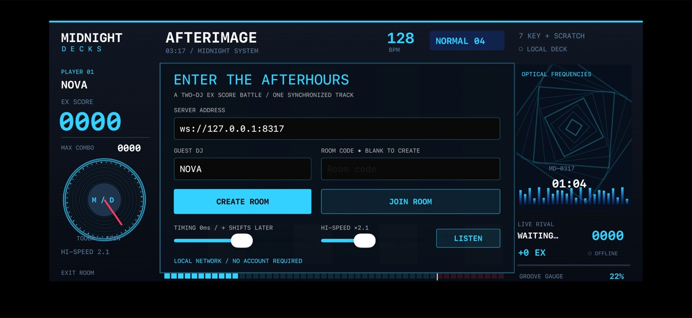

# Midnight Decks



A native landscape iPhone rhythm battle, inspired by beatmania IIDX's seven-key
DJ deck. Original vector graphics and a generated 64-second electronic track.
Two guests play the same chart over a real authoritative WebSocket connection.
Display name **Midnight Decks**, bundle ID **ai.midnightdecks.rhythm**.

## Build and run

Tested toolchain: macOS 26.5.2, Xcode 26.6 / iOS Simulator 26.5, Node 20+.
No Apple developer account is needed for simulator builds.

```sh
cd midnight-decks
npm --prefix Server ci
npm --prefix Server test
npm --prefix Server run check
npm --prefix Server audit
xcrun swift-format lint --strict --recursive App
xcodebuild -project MidnightDecks.xcodeproj -scheme MidnightDecks \
  -configuration Release -destination 'generic/platform=iOS Simulator' \
  -derivedDataPath build CODE_SIGNING_ALLOWED=NO build
test -s build/Build/Products/Release-iphonesimulator/MidnightDecks.app/chart.json
test -s build/Build/Products/Release-iphonesimulator/MidnightDecks.app/afterimage.wav
```

The Xcode project is checked in. To regenerate after changing `project.yml`,
install XcodeGen 2.46.0 and run `xcodegen generate`. To regenerate the original
audio/chart, run `node Tools/compose.mjs`; the generated assets are checked in
and used directly by the app. No asset download is needed at runtime.

Start the server separately:

```sh
npm --prefix Server start
# Defaults to 0.0.0.0:8317. Override with PORT=8318 npm --prefix Server start.
curl http://127.0.0.1:8317/health
```

Open two separate iPhone simulators, using IDs from `xcrun simctl list devices`.
Install the same app on each:

```sh
xcrun simctl boot "$DEVICE_A"
xcrun simctl boot "$DEVICE_B"
xcrun simctl bootstatus "$DEVICE_A" -b
xcrun simctl bootstatus "$DEVICE_B" -b
xcrun simctl install "$DEVICE_A" build/Build/Products/Release-iphonesimulator/MidnightDecks.app
xcrun simctl install "$DEVICE_B" build/Build/Products/Release-iphonesimulator/MidnightDecks.app
xcrun simctl launch "$DEVICE_A" ai.midnightdecks.rhythm
xcrun simctl launch "$DEVICE_B" ai.midnightdecks.rhythm
open -a Simulator
```

In the first app enter a name and create a room. Enter its displayed code in the
second app and join with another name. Press READY on both devices. The server
announces one future start instant and both players run the 64-second song.
Each device displays both scores; the final result is determined by EX score.
Both press REMATCH to reset scores and schedule another common start.

For physical devices on the same LAN, set the editable address to
`ws://YOUR_MAC_LAN_IP:8317` and allow local network access. Use the Xcode project
with your own signing configuration for physical installation. No public
deployment is configured.

## Controls and scoring

- Put the iPhone in landscape on a flat surface. Touch the seven key faces;
  simultaneous fingers support chords. White/blue keys alternate.
- Hold purple charge notes from head to tail, then release on the tail.
  Both endpoints are scored independently. Early release breaks the combo.
- Drag/spin the turntable (or swipe in SCR) to strike red scratch notes.
- Hardware keyboard: **S D F Space J K L**, scratch **left/right Shift**.
- Hit the red line. Windows are inclusive ±25 ms PERFECT GREAT (2 EX),
  ±55 ms GREAT (1 EX), ±95 ms GOOD (0 EX), ±140 ms BAD (0 EX); otherwise POOR.
- Timing slider: positive values move input timestamps later, range ±100 ms.
  Adjust using the FAST/SLOW judgment readout. Scroll speed changes visibility,
  never song timing or judgments.
- Gauge starts at 22%; PG +1.2, G +0.8, GOOD +0.3, BAD −3, POOR −5,
  clamped to 2–100%. End at ≥80% for GROOVE CLEAR. Battle winner uses EX score
  independently of clear status. Equal EX is a draw.
- LISTEN previews the actual song; STOP ends preview. EXIT prompts before leaving.
- After a network break, tap RECONNECT. The in-memory bearer token reclaims the
  same peer and score. The song continues while disconnected and missed notes
  still count. Fully disconnected rooms expire after two minutes.

## Repeatable native two-device test

These launch arguments enable a **visibly labeled automated input driver**.
It calls the exact `Session.input(lane:down:)` route used by touch/keyboard;
that sends actual ordered WebSocket input. It does not set score, gauge, health,
victory or server time. The delay deliberately makes the second DJ less precise.
Keep both simulator displays visible during the same capture.

```sh
xcrun simctl launch "$DEVICE_A" ai.midnightdecks.rhythm \
  --connect --create --room NIGHT --name NOVA --auto --auto-rematch
xcrun simctl launch "$DEVICE_B" ai.midnightdecks.rhythm \
  --connect --room NIGHT --name ECHO --auto --delay-ms 20 --auto-rematch
```

`--server ws://HOST:PORT` overrides the default address. A named room must not
already exist when using `--create`. Use a new code on later test runs.
Wait through the song, shared result, and automatic second-round countdown.
The driver only auto-rematches round one. The test must also exercise manual
key presses, hold/release and scratch gestures, without `--auto`, in a separate
control pass. Do not mistake driver coverage for touch coverage.

Each app writes `Documents/telemetry.jsonl`, containing per-second snapshots,
distinct player ID, room, round, score/counts, common start, song/audio clock,
RTT and driver label. Get the container with:

```sh
xcrun simctl get_app_container "$DEVICE_A" ai.midnightdecks.rhythm data
```

The server emits JSON lines for join/start/judgment/result/disconnect.
The assertion script accepts both telemetry files:

```sh
node Tools/assert-match.mjs /path/to/a/telemetry.jsonl /path/to/b/telemetry.jsonl
```

For simultaneous device streams, start two `xcrun simctl io DEVICE recordVideo`
processes concurrently, then stop both with SIGINT and compose with ffmpeg.
Preserve complete device frames. Device recording does not capture audio;
capture actual system audio separately if available, and document that choice.
Never silently dub audio and claim it proves actual playback synchronization.

On a macOS VM without an audio device, install `blackhole-2ch` through Homebrew
and verify `system_profiler SPAudioDataType` lists a working output **before**
booting the simulators. A simulator booted without host audio may retain a stale
CoreAudio endpoint until restarted. Actual BlackHole loopback capture and app
audio clocks were verified on this environment.

The recorded two-iPhone run used a 20 ms ECHO delay and passed the unchanged
assertions, including all 191 endpoints per player and round two. A prior 38 ms
run fell below the accuracy threshold under simulator scheduling load; the
driver does not override judgments to guarantee a result. Separate manual
controls were exercised, but precisely timed manual charge scoring, every
hardware mapping, and physical-device latency remain unverified.

## Architecture and protocol

`App/DeckView.swift` draws the animated deck at 60 Hz with Core Graphics and
routes actual UIKit multitouch and keyboard events. `Session.swift` owns network,
clock synchronization, telemetry and the optional input driver. `Audio.swift`
schedules the bundled PCM track with `AVAudioPlayer.play(atTime:)` and synthesizes
short per-key feedback sounds. The full backing track is audible even on misses;
it is not a reconstruction of IIDX's per-note keysound mixing.

`Server/server.mjs` uses pinned `ws`, 20 Hz authoritative snapshots and per-peer
state. `game.mjs` adjudicates chart endpoints and maintains scores. See
[the protocol specification](Docs/PROTOCOL.md) and [reference audit](Docs/REFERENCE.md).

## Known boundaries

- One original NORMAL chart/song, not an IIDX song library or complete mode set.
- No BSS reversal, HCN, random lane modifiers or arcade e-amusement features.
- The guest server is for trusted local play. Timestamp bounds and sequence
  checks mitigate errors, not adversarial competitive cheating. The bundled
  chart driver intentionally demonstrates why this is not anti-cheat software.
- Room/token identity survives an interrupted connection in the running app;
  app process termination and server restart do not persist rooms or scores.
- Audio/visual timing is estimated from a minimum-RTT clock sample and locally
  scheduled audio. Hardware output latency is device-dependent; tune calibration.
  No claim of sub-millisecond or physical arcade parity.
- Small text and custom-drawn gameplay are not a full VoiceOver experience.
  Native lobby fields/sliders/buttons have accessibility labels.
- Artwork is original and reference-inspired. No literal pixel parity claim;
  see the observed versus inferred reference notes.
