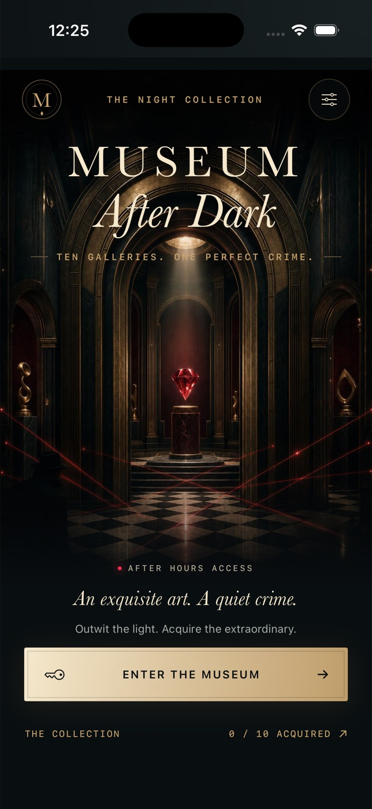

# Museum After Dark



A native, offline iPhone stealth puzzle in SwiftUI. Ten authored museum rooms, ruby security lasers, rotating amber searchlights, mirrors, independent power circuits, unlimited undo, par medals and a locally saved collection.

## Art direction

A nocturnal Art Deco museum: champagne brass, oxblood velvet, veined stone and ruby light. The bespoke generated museum illustration is bundled locally as `MuseumHero`; the playable architecture, artifacts, engraved controls and acquisition certificate are drawn natively in SwiftUI. No image service is called at runtime. Home framing and button motion follow Reduce Motion, as do acquisition effects. The shared dossier renders the same native certificate as the result screen.

## Build and run

Requires macOS with Xcode 26.6 (tested), iOS 17+ deployment target, no signing credentials or external services. The checked-in Xcode project and shared `MuseumAfterDark` scheme run directly in Xcode: choose an iPhone simulator and Run.

From this directory:

```sh
xcodebuild -project MuseumAfterDark.xcodeproj -scheme MuseumAfterDark -configuration Debug -sdk iphonesimulator -destination 'generic/platform=iOS Simulator' -derivedDataPath build CODE_SIGNING_ALLOWED=NO build
xcodebuild -project MuseumAfterDark.xcodeproj -scheme MuseumAfterDark -configuration Release -sdk iphonesimulator -destination 'generic/platform=iOS Simulator' -derivedDataPath build CODE_SIGNING_ALLOWED=NO build
xcrun simctl list devices available
# Substitute an available simulator UUID:
xcodebuild -project MuseumAfterDark.xcodeproj -scheme MuseumAfterDark -destination 'platform=iOS Simulator,id=SIMULATOR_UUID' -derivedDataPath build CODE_SIGNING_ALLOWED=NO test
xcrun simctl install SIMULATOR_UUID build/Build/Products/Debug-iphonesimulator/MuseumAfterDark.app
xcrun simctl launch SIMULATOR_UUID ai.devin.museum.afterdark
```

No third-party app dependencies. If changing project settings, install XcodeGen (`brew install xcodegen`) then run `xcodegen generate`; `project.yml` is the source of project configuration.

```sh
xcrun swift-format lint --strict --recursive Sources Tests Scripts
# Regenerate the procedural icon:
swift Scripts/GenerateIcon.swift Resources/Assets.xcassets/AppIcon.appiconset/AppIcon.png
```

## Controls and rules

- Tap a mint-outlined neighbor to move one tile. The tiny hat-and-coat figure is you.
- Ruby or amber crosses mark neighboring tiles that are unsafe now or after the next sweep.
- Tap an adjacent brass node (I or II) to toggle the corresponding laser circuit.
- Tap an adjacent round mirror to swap its diagonal. Mirrors reflect beams by 90 degrees.
- Searchlights rotate clockwise after **every** valid action, including Wait, node toggles and mirror rotations. Dotted amber tiles forecast the next sweep.
- Entering a currently lit tile **or** ending a turn in the new light catches you. Walls block beams. Security devices and mirrors cannot be walked through.
- Step onto the artifact, then return to the green EXIT. Complete each gallery to unlock the next. Reach the par move count or better for a perfect medal.
- Undo restores the full previous turn, including power, mirror, artifact and guard phase. Restart resets only the current attempt.
- Every action saves locally, including undo history; best scores and unlocks survive relaunch. Pause appears when backgrounding an active attempt.
- Share dossier opens the real native iOS share sheet with a rendered result image and text.

## Accessibility and limits

Interactive board tiles and controls have accessibility labels and identifiers. Menus scroll on smaller screens. Animations honor Reduce Motion. The game uses fixed board geometry; spatial play is visually oriented and is not a fully nonvisual game. Portrait iPhone is the intended presentation. Audio is optional system feedback; haptics use UIKit. Simulator checks cannot validate physical haptics, hardware audio, or delivery to third-party share destinations.

No daily mode, online leaderboard, account, advertising, analytics, purchases, or backend.

## Verification

`HeistEngineTests` covers all reflection directions, illegal actions, independent circuits, current and next-turn hazards, wall occlusion, artifact/exit gating, persistent undo/settings, unlocks, and breadth-first search for an achievable par solution in every authored room. UI evidence, the original three visual review passes, and the subsequent Art Deco redesign are documented in the accompanying QA/design reports.
