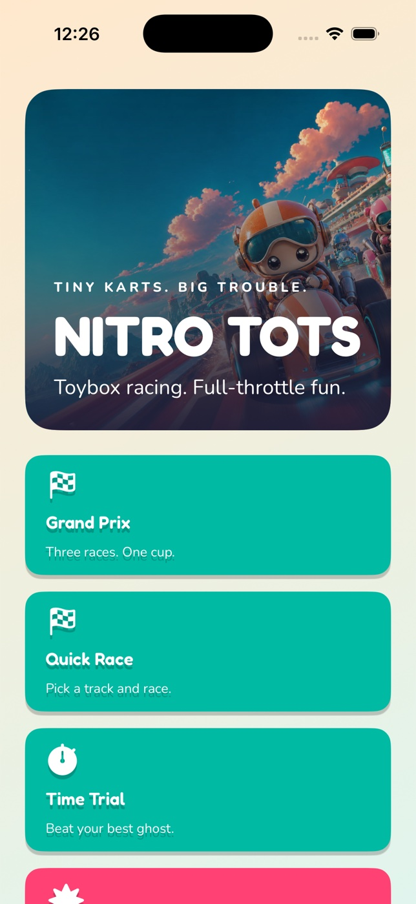

# Nitro Tots



A native arcade kart racer for **macOS, iPhone and iPad**. SwiftUI provides the
menus and adaptive controls; SpriteKit renders the race. The Apple client uses a
Swift port of the original rules offline and for prediction, and real
`URLSessionWebSocketTask` connections to the unchanged authoritative Dart server.
There is no Flutter runtime, Dart client, browser, or web wrapper.

## Game

- Eight original characters and six karts with combined speed, acceleration,
  handling and weight stats.
- Sprinkle Speedway, Mossy Hollow, Tin City Loop and Frostbite Pass, with boost
  pads, jumps, shortcuts, surfaces and moving hazards; Bumper Bowl battle arena.
- Grand Prix cups with fixed opponents and accumulated standings, quick races,
  time trials with saved best-run ghosts, and balloon battles.
- Drift boosts, rocket starts, slipstream, wrong-way detection, respawns and all
  eight items, including reverse throws while looking back.
- Title, garage, track/cup selection, online create/join, lobby, race, results,
  next race/rematch and settings screens.
- Up to eight online racers, host settings, ready-up, adjustable bot difficulty,
  bot filling, input acknowledgements, prediction/reconciliation and remote
  interpolation. Reconnection resumes the same identity and active race.
- Original artwork, kart/scenery sprites, WAV music/effects and Fredoka/Nunito
  fonts. Both OFL licenses are bundled in `apple/Resources/fonts/`.

## Layout

```text
apple/NitroTots.xcodeproj   checked-in native project and shared schemes
apple/project.yml         XcodeGen source of truth
apple/App/                SwiftUI, SpriteKit, storage, controls, networking
apple/Core/               independently tested Swift package
apple/Resources/          original art, audio, fonts/licenses and app icons
packages/nitro_core/      original pure Dart rules, catalogs and protocol
packages/nitro_server/    original authoritative WebSocket server
tools/                    native regression checks and Dart fixture exporter
test/                     real-backend harness and room-result verifier
PROTOCOL.md               wire contract
.devin/clone-this/        historical Flutter-era evidence only
```

## Requirements

- macOS with Xcode and command-line tools. Validated with Xcode 26.6.
- Deployment targets: **iOS/iPadOS 17**, **macOS 14**. Device families `1,2`.
- Dart **3.13.3 or compatible with `^3.13.3`**, for the server, Dart tests and
  catalog regeneration. A Dart SDK is sufficient; Flutter is not required.
- Optional XcodeGen (validated with 2.46.0) to regenerate the checked-in project.
- Python 3 for the optional room-result verifier and audio generator.

## Build and run

Open `apple/NitroTots.xcodeproj` in Xcode. Select **NitroTots-macOS** or
**NitroTots-iOS**, choose My Mac/an iPhone/an iPad destination, then Run.
For physical devices, select your signing team in Xcode.

From `nitro-tots/`:

```sh
# Only needed after changing project.yml or adding/removing source files:
(cd apple && xcodegen generate)

xcodebuild -project apple/NitroTots.xcodeproj -scheme NitroTots-macOS \
  -configuration Debug -destination 'platform=macOS' \
  -derivedDataPath apple/.derived/mac CODE_SIGNING_ALLOWED=NO build
open apple/.derived/mac/Build/Products/Debug/NitroTots.app

xcodebuild -project apple/NitroTots.xcodeproj -scheme NitroTots-iOS \
  -configuration Debug -sdk iphonesimulator \
  -destination 'generic/platform=iOS Simulator' \
  -derivedDataPath apple/.derived/ios CODE_SIGNING_ALLOWED=NO build

# After booting an iPhone or iPad simulator in Xcode:
xcrun simctl install booted apple/.derived/ios/Build/Products/Debug-iphonesimulator/NitroTots.app
xcrun simctl launch booted dev.nitrotots.nitroTots
```

The existing bundle identifier `dev.nitrotots.nitroTots` is retained on both
platforms. Shell builds above disable signing for build verification; Xcode can
sign for local development and device installation.

### Multiplayer server

```sh
cd packages/nitro_server
dart pub get
dart run bin/nitro_server.dart --host 0.0.0.0 --port 8787 --seed 4242 --verbose
```

In Settings or Online, enter a WebSocket URL; the default is
`ws://localhost:8787/ws`. Physical iPhones/iPads need the Mac's reachable LAN
address, such as `ws://192.168.1.10:8787/ws`. Use `wss://` for an Internet server.
The app includes the local-network privacy description and ATS development
allowances for configurable plaintext local WebSocket endpoints. The macOS
sandbox has the network-client entitlement. Release distribution should use
TLS and tighten the ATS policy for the deployed endpoint.

Choose **Online → Create room**, share the code, and join on the other devices.
Players ready up, then the host starts. Lobby settings include cup/single race/
battle, laps, room size, minimum human players, bot filling and bot skill.

Connection failures and server errors appear in the app. Retries are bounded to
six attempts, cancel previous sockets/tasks, and use generation checks to discard
stale callbacks. Resume credentials are stored in Keychain per server URL;
preferences and time-trial ghosts use UserDefaults. Existing Apple
SharedPreferences profile/settings/ghost keys are read on first native launch.
Old plaintext resume keys are removed only after successful Keychain migration.

## Controls

| Action | Keyboard |
| --- | --- |
| Gas | Up / W |
| Brake / reverse | Down / S |
| Steering | Left / Right / A / D |
| Drift / air trick | Space / Shift |
| Item | Z / X / E / Enter / Control |
| Look back / reverse item aim | Q / Option (Alt) |
| Pause | Escape / P |

Touch uses the steering pad plus gas, brake, drift, item and look-back buttons;
simultaneous steering and button presses are retained. iPhone/iPad support
portrait and landscape safe areas and hardware keyboards. Mac windows resize.
Settings include automatic/touch/keyboard controls, auto-accelerate, chase/fixed
camera, haptics, reduced motion, theme and audio volume. Online pause leaves the
authoritative match running.

## Validation

Run from `nitro-tots/`:

```sh
swift test --package-path apple/Core
bash tools/test-native-client.sh

(cd packages/nitro_core && dart pub get && dart test && dart analyze)
(cd packages/nitro_server && dart pub get && dart test && dart analyze)

# Starts an isolated real Dart backend, then two native headless clients:
DART=dart NT_PORT=8788 bash test/multiplayer-e2e.sh

# Or use an already running backend:
NT_SERVER=ws://127.0.0.1:8787/ws bash tools/test-native-protocol.sh

xcrun swift-format lint --strict --recursive apple/App apple/Core/Sources apple/Core/Tests tools/*.swift
xcrun swift-format lint --strict apple/Core/Package.swift
dart format --output=none --set-exit-if-changed tools/export_native.dart
dart analyze tools/export_native.dart
bash -n tools/test-native-client.sh tools/test-native-protocol.sh test/multiplayer-e2e.sh
```

The Swift package runs the native rules against Dart-generated checkpoints and
final results for all five tracks. Client checks cover item pulses at 60/120 Hz,
reverse throws, triple-turbo charges, simultaneous touch input, pause, persistence,
cup identity/progression, time trials and lobby/rematch regressions.
The real-server smoke exercises hello, room creation/join, settings, ready-up,
bot seats, live inputs/snapshots, a rejected host-only action, disconnect/resume,
matching results/hash, profile changes, rematch and leaving.

The native model checks, real-server checks and both Apple compiler builds have
been run. **Native UI-driven testing and visual parity have not been performed.**
Historical Flutter screenshots/results under `.devin/clone-this/` do not validate
the new native UI. The retired browser/platform drivers and Flutter widget tests
were replaced by the native checks; original Dart server/core tests remain.

### Regenerating catalogs and compatibility fixtures

From `nitro-tots/`, after an intentional Dart rules/catalog change:

```sh
dart tools/export_native.dart
swift test --package-path apple/Core
```

The exporter imports the original Dart core. It writes the native catalog and
deterministic fixture snapshots/results. Treat those as generated files, and port
rule changes to Swift before accepting fixture changes. The generated catalogs
must be bundled with both apps; the Xcode project already does this.

### Runtime automation configuration

`NT_*` process environment values work on macOS and iOS. Launch arguments
`--NT_NAME=value` and `--NT_NAME value` override environment values. Simulator
environment values can be passed with the `SIMCTL_CHILD_` prefix.

| Setting | Purpose |
| --- | --- |
| `NT_SERVER`, `NT_PORT` | Explicit server URL, or override the default URL's port |
| `NT_NAME`, `NT_CHARACTER`, `NT_KART`, `NT_THEME` | Profile/theme overrides |
| `NT_TEST=1` | Ephemeral test identity, automatic room actions and race autopilot |
| `NT_HOST=1`, `NT_ROOM`, `NT_PLAYERS` | Create/join room and expected human count |
| `NT_READY=0` | Disable automatic ready-up |
| `NT_MODE`, `NT_CUP`, `NT_LAPS` | `race`/`battle`/`timeTrial`, cup and lap count |
| `NT_LANE` | Autopilot lane offset |
| `NT_SCREEN` | Open title, garage, track, online or settings directly |
| `NT_STILL=1` | Deterministic preferences, frozen menu/race updates for capture |
| `NT_WINDOW=800x532` | Initial macOS window size |

Test identities/settings are not persisted. Native clients send the existing
`test_report` hash/standings payload at match completion. The retained
`test/verify_room.py` can independently compare platform reports to the server.
There are no Dart build defines or browser query parameters in the Apple client.

Original sound synthesis remains available via `python3 tools/gen_audio.py`.
