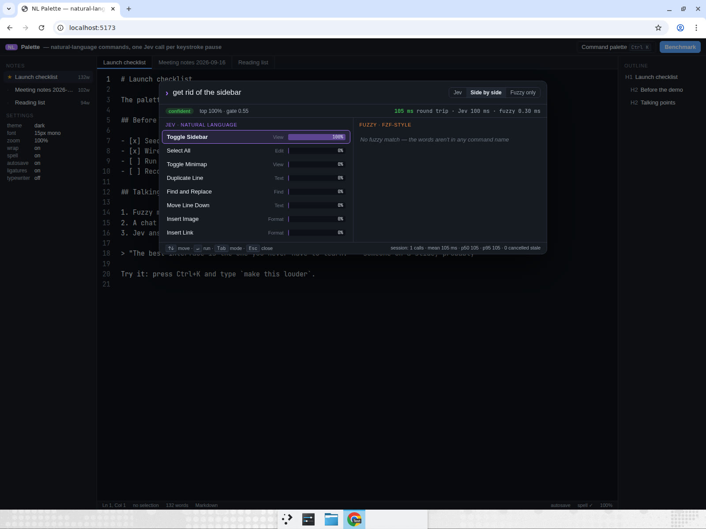
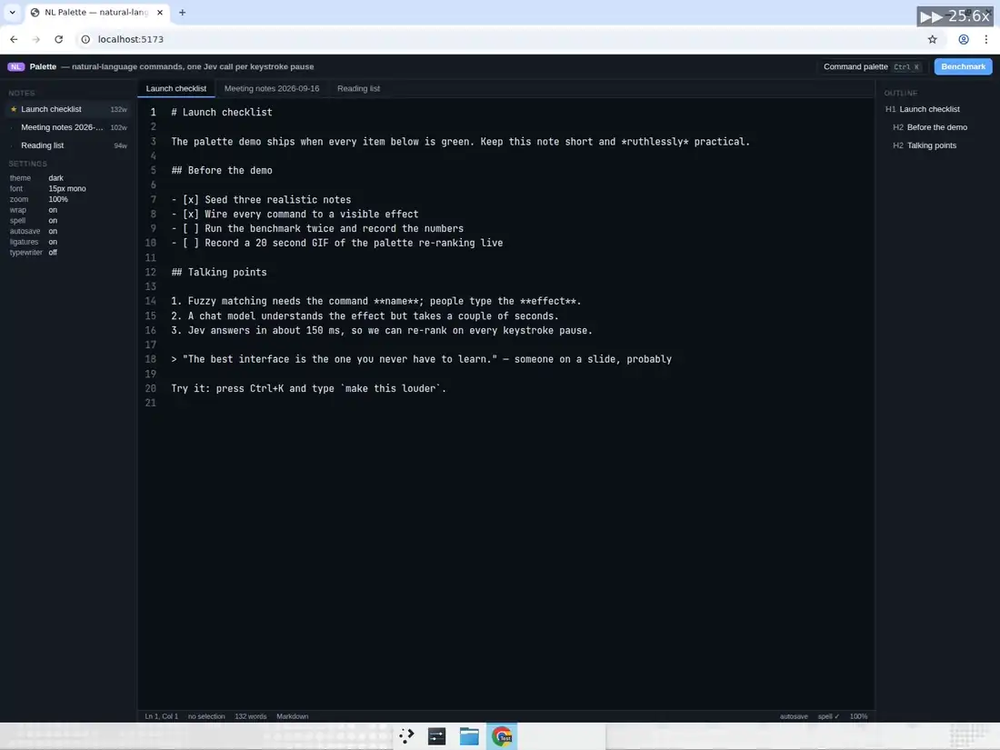
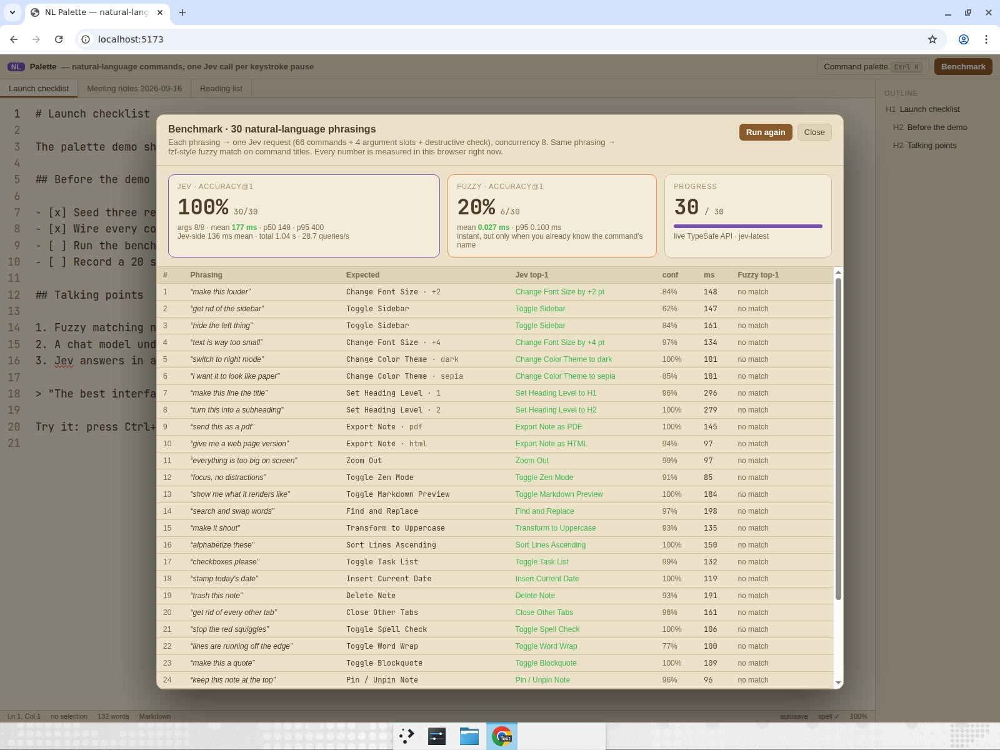

# NL Palette

**A command palette that understands what you mean, re-ranked on every keystroke pause.**
66 editor commands + 4 typed argument slots resolved in one ~150 ms Jev call.
Live benchmark: **accuracy@1 100 % (30/30) vs fuzzy 20 % (6/30)**.





## The problem

Command palettes (VS Code, Linear, Figma, Raycast) are keyed on **command names**. Fuzzy
matching is instant, but it only works if you already know the name:

| You type                  | You mean                 | fzf-style result          |
| ------------------------- | ------------------------ | ------------------------- |
| `make this louder`        | Change Font Size **+2**  | no match                  |
| `get rid of the sidebar`  | Toggle Sidebar           | no match                  |
| `hide the left thing`     | Toggle Sidebar           | no match                  |
| `i want it to look like paper` | Change Color Theme **sepia** | no match             |
| `send this as a pdf`      | Export Note **as PDF**   | no match                  |

LLM function-calling fixes the intent problem but costs 1–3 s per call. In a palette that
re-ranks while you type, that's unusable: by the time the answer lands you have typed three
more words.

## Why latency matters here

The palette fires **one request per keystroke pause** (100 ms debounce, stale requests aborted).
That only works if a request finishes before the next pause, i.e. well under ~300 ms. Jev
routes the query to a command **and** fills its typed argument in a single ~100–200 ms
round trip, so the list re-ranks like search-as-you-type, with a live probability bar and an
argument preview ("Change Font Size by +2 pt") on the top result.

## How Jev is used

Every request sends the same state — `{ query, app_state }`, where `app_state` is the live
editor state (`sidebar_visible`, `theme`, `font_size`, `zoom_percent`, `selection_exists`,
`open_tabs`, `word_wrap`, …) — with **six questions asked at once** (fan-out). Only the
argument slot belonging to the winning command is read; the others are speculative.

| id                | type   | what it judges                                                                                                                       |
| ----------------- | ------ | ------------------------------------------------------------------------------------------------------------------------------------ |
| `command`         | choice | Which of the 66 commands the user wants. Criteria = `"<Title>: <plain-language description>"` per command id. Instructions note that `app_state` disambiguates hide/show and that text size ≠ zoom. |
| `font_size_delta` | choice | `-4 / -2 / +2 / +4` — direction and magnitude ("a lot", "way" ⇒ 4).                                                                |
| `theme`           | choice | `dark / light / sepia / high_contrast` — "night" ⇒ dark, "paper" ⇒ sepia, "readable" ⇒ high contrast, "different look" ⇒ contrast with current theme. |
| `heading_level`   | choice | `1 … 6` — "title" ⇒ 1, "subheading" ⇒ 2, "h4" ⇒ 4.                                                                                  |
| `export_format`   | choice | `markdown / html / pdf / plain_text`.                                                                                                |
| `is_destructive`  | noul   | Does the request permanently discard content or close work?                                                                          |

Computed in code from those answers (`src/shared/resolve.ts`):

- **ranking** — commands sorted by the `command` probability map; the top result's argument
  slot is filled from the matching speculative answer.
- **confidence gate** — top probability ≥ 0.55 → one highlighted action, Enter runs it.
  Below → the top-3 are shown with dashed borders and Enter is ignored until you arrow/hover
  to an explicit pick.
- **wants_confirmation** — the chosen command is flagged destructive **or**
  `is_destructive ≥ 0.5` → a confirmation dialog before running.

Question builders live in `src/shared/questions.ts`; the only TypeSafe call is
`server/jev.ts` (`POST /v1/systemone`, `model: "jev-latest"`, retries on 429/529 with
backoff). The API key never leaves the Node proxy.

## The editor

A real Markdown/notes editor so that every command visibly does something: sidebar, outline,
tabs (close / reopen / next / previous), four themes, font size & family, zoom, split view,
Markdown preview, zen mode, typewriter mode, minimap, line numbers, word wrap, find & replace,
go to line, export (MD / HTML / PDF / TXT), heading levels, bold/italic/strike/code, lists,
task lists, block quotes, tables, links, images, sort / dedupe / join / move / duplicate /
delete lines, case transforms, undo/redo, pin, rename, delete note. 66 commands total, all
in `src/shared/commands.ts` and executed by `src/editor/execute.ts`.

## Comparison and benchmark

- **Side by side** (Tab in the palette) shows the Jev ranking next to an fzf-style fuzzy
  ranking (`src/shared/fuzzy.ts`: consecutive/word-boundary/camel-case bonuses, gap penalties,
  every query term must match the title or id). **Fuzzy only** turns the palette into a plain
  fuzzy palette.
- **Benchmark** runs 30 phrasings (`src/data/benchmark.ts`: 24 describe an *effect*, 6 are
  partial command names so fuzzy gets a fair shot) through both approaches with concurrency 8
  and shows accuracy@1, argument accuracy, mean / p50 / p95 latency, total elapsed and
  queries/s. Every number is measured in the browser with `performance.now()`.

## Measured results

Live TypeSafe API (`jev-latest`), Linux VM, run from the in-app Benchmark button:

| approach          | accuracy@1     | args          | mean latency | p50    | p95    | total (30 queries, concurrency 8) |
| ----------------- | -------------- | ------------- | ------------ | ------ | ------ | --------------------------------- |
| **Jev**           | **100 % (30/30)** | **8/8**    | 177 ms       | 148 ms | 400 ms | 1.04 s · 28.7 queries/s           |
| fzf-style fuzzy   | 20 % (6/30)    | n/a           | 0.03 ms      | —      | 0.1 ms | —                                 |

Single palette queries in the recording: 105–135 ms browser round trip (Jev-side ~100–125 ms).
The terminal benchmark (`npm run bench`) on the same day reported mean 118 ms, p50 114 ms,
p95 210 ms. Each request is ~3.2 k input tokens (66 criteria + 5 more questions).



## Run it

```sh
cd nl-palette
npm ci
export TYPESAFE_API_KEY=...   # never shipped to the browser; read only by server/
npm run dev                   # Node proxy on :8787 + Vite on :5173
```

Open http://localhost:5173, press **Ctrl/Cmd+K**, type `make this louder`, press Enter.
Click **Benchmark → Run benchmark** for the 30-case comparison.

- `MOCK=1 npm run dev` — offline mode; the proxy answers from the fuzzy ranker and the UI
  labels every result **MOCK**.
- `npm run bench` — the same 30 cases from the terminal, with a summary table.
- `npm run build` (`tsc -b && vite build`), `npm run typecheck`, `npm run lint`
  (`oxlint --deny-warnings src server`), `npm test` (vitest: fuzzy scorer, resolver /
  confidence policy, question builders, stats, editor command executor).

## Layout

```
server/index.ts      node:http proxy: POST /api/resolve, GET /api/health
server/jev.ts        the single TypeSafe call (systemone, timing, backoff)
server/mock.ts       MOCK=1 answers
server/bench.ts      terminal benchmark
src/shared/          commands, questions, resolve (policy), fuzzy, stats — shared by server & UI
src/editor/          pure editor model + command executor
src/lib/             browser Jev client, debounced palette hook
src/components/      Palette, Benchmark
src/data/            30 benchmark phrasings
```
