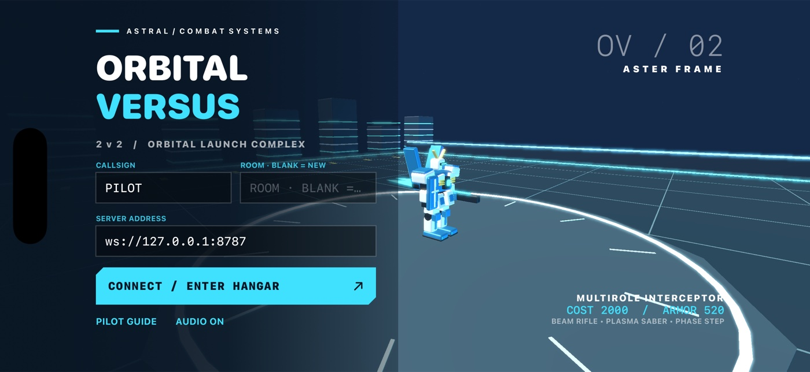

# Orbital Versus



A native **iPhone landscape** 3D mecha arena game. SwiftUI + SceneKit, original
articulated Aster/Vesper frames and synthesized audio, authoritative WebSocket
combat. Two human guest pilots face each other with one clearly marked AI wingman
each. Created as an original adaptation of the **Extreme Vs.** reference.

## Requirements and build

Verified toolchain: macOS, Xcode 26.6 / Swift 6 compiler (Swift 5 language mode),
iOS 26.5 simulators, Node 22+. Minimum iOS target 17. No developer account is
required for simulator builds. All project files are inside this directory.

```sh
cd orbital-versus
npm --prefix Server ci
bash Scripts/check.sh
# Output: build/Build/Products/Debug-iphonesimulator/OrbitalVersus.app
```

The generated Xcode project is committed and usable directly. To change project
structure, install XcodeGen (`brew install xcodegen`; authored with 2.46.0), edit
`project.yml`, then run `xcodegen generate`. Audio assets are bundled; recreate
them deterministically with `python3 Scripts/generate_audio.py`.

Supported lint: `xcrun swift-format lint --strict --recursive App Tests`.
Format: `xcrun swift-format format --in-place --recursive App Tests`.
Server checks: `npm --prefix Server run lint`, `npm --prefix Server test`,
`npm --prefix Server audit --audit-level=moderate`.

## Play on two devices

```sh
npm --prefix Server start
# In another terminal:
xcrun simctl list devices available
# Set these to TWO DIFFERENT iPhone simulator IDs from that list:
A="FIRST_SIMULATOR_UUID"
B="SECOND_SIMULATOR_UUID"
xcrun simctl boot "$A"
xcrun simctl boot "$B"
xcrun simctl bootstatus "$A" -b
xcrun simctl bootstatus "$B" -b
open -a Simulator
APP="$PWD/build/Build/Products/Debug-iphonesimulator/OrbitalVersus.app"
xcrun simctl install "$A" "$APP"
xcrun simctl install "$B" "$APP"
xcrun simctl launch "$A" ai.devin.orbitalversus.ios --name ALPHA --room ORBIT --join
xcrun simctl launch "$B" ai.devin.orbitalversus.ios --name BETA --room ORBIT --join
```

Both press **READY / SORTIE**. The three-second launch countdown begins. Tilt is
not required: the left joystick moves relative to the locked enemy. For real
devices replace the server field with `ws://YOUR_LAN_HOST_IP:8787`, on the same
network, and allow iOS local-network permission. Hardware installation requires
your own signing setup, which is not needed for these simulator instructions.

### Controls

| Control | Action |
| --- | --- |
| Left stick | Strafe and approach/retreat relative to locked opponent |
| BOOST (hold) | Dash + climb; release to land and refill |
| FIRE | Beam rifle; 7 rounds with automatic reload |
| SABER | Lunge within 19m; chain three hits at close range |
| STEP | Short evasive dash, attack cancel and brief invulnerability |
| LOCK | Switch opposing human/AI targets |
| GUARD (hold) | Slow movement, reduce incoming damage |
| EX | At 50% charge, 7 seconds enhanced speed/damage/fire rate |
| Speaker | Mute/unmute music and effects |

6000 team cost, human deaths cost 2000, AI deaths 1500. Frames respawn until cost
is gone. At 90 seconds, cost plus remaining armor decides. Both pilots vote
**REMATCH** to reset and launch again. **HANGAR** disconnects after results.
Connection errors expose **RECONNECT**, preserving identity for 60 seconds.

## Reproducible automated device match

Launch each device with its own name but the same room, adding
`--autopilot --auto-ready --auto-rematch`. The visible **AUTOMATED INPUT DRIVER**
label identifies this automation; **TAKE CONTROL** disables it. The driver only
operates the same movement/action queue as the actual touch controls. It cannot
set health, score, positions, time or outcome.

```sh
xcrun simctl launch "$A" ai.devin.orbitalversus.ios --name ALPHA --room RECORD \
  --join --autopilot --auto-ready --auto-rematch
xcrun simctl launch "$B" ai.devin.orbitalversus.ios --name BETA --room RECORD \
  --join --autopilot --auto-ready --auto-rematch
```

Record both simulators **simultaneously** using separate
`xcrun simctl io "$A" recordVideo alpha.mov` / `"$B" ... beta.mov` processes,
or capture the desktop with both complete displays visible. Stop both with SIGINT
after the common result and round-two launch. Compose matching-time streams
side-by-side without cropping either display. Do not splice different matches.
Keep both names, room and round visible. `simctl` video has no app-audio track;
do not present a synthesized post-dub as captured gameplay sound.

### Capture actual game audio

On a macOS VM, verify `system_profiler SPAudioDataType` lists a working default
input/output **before** booting simulators. This VM used BlackHole 2ch 0.7.1:

```sh
brew install --cask blackhole-2ch
system_profiler SPAudioDataType
# Only if the newly installed endpoint is still absent:
sudo -n killall coreaudiod
system_profiler SPAudioDataType
```

Check that BlackHole is the default input, output and system output (48kHz
stereo here). Restart simulators that booted without the endpoint; a VM reboot
was unnecessary. If noninteractive activation fails, resolve host permissions
before continuing. Allow native microphone capture permission if prompted.

FFmpeg 9.0.1 AVFoundation polling lost sample packets in preflight. The native
callback recorder below captured continuous PCM without that loss:

```sh
mkdir -p evidence/audio
swiftc Scripts/NativeAudioCapture.swift -o evidence/audio/native-audio-capture
evidence/audio/native-audio-capture "$PWD/evidence/audio/run-01" 420
```

Use a fresh prefix each time. The duration is an upper bound; create
`evidence/audio/run-01.stop` to stop early. Wait for the recorder's `READY` line,
start both device recordings, wait for both `Recording started` messages,
then launch the two apps. Record process/ready/launch clocks using
`mach_absolute_time` converted to seconds. The helper writes direct PCM to
`<prefix>.wav`, callback `pts`/`arrivalHost`/frame counts and offsets to
`<prefix>-packets.jsonl`, and totals to `<prefix>-metadata.json`.

Use audio `firstPTS` as the composition origin and measured video-ready clocks
as video offsets. Keep the captured audio intact; do not replace it with bundled
assets. Preserve originals, packet logs, telemetry and mux commands. Check
callback continuity, nonzero RMS and clipping, then decode the final AAC and
compare early/late windows against raw PCM for lag, drift and trimming.
Isolate one app at a time for AUDIO ON/OFF/ON checks so the other app cannot mask
mute. In the verified run each OFF interval had RMS zero; ON intervals matched
the original music, and the 65.8035s match capture had zero callback gaps.

The WAV writer can warn about interleaving conversion; verify output frame
counts rather than suppressing diagnostics. Raw simulator videos can also have
timestamp warnings. Document VFR normalization, endpoint frame holds and start
uncertainty (about 222ms in this run). Full MP4 decode and visible inspection
are still required; this workflow does not establish hardware synchronization.

### Retrieve gameplay telemetry

Each native sandbox writes `Documents/telemetry.jsonl`, including peer welcome,
phase changes, control requests and authoritative snapshots. Retrieve both:

```sh
DA="$(xcrun simctl get_app_container "$A" ai.devin.orbitalversus.ios data)"
DB="$(xcrun simctl get_app_container "$B" ai.devin.orbitalversus.ios data)"
mkdir -p evidence
cp "$DA/Documents/telemetry.jsonl" evidence/alpha.jsonl
cp "$DB/Documents/telemetry.jsonl" evidence/beta.jsonl
python3 Scripts/verify_evidence.py evidence/alpha.jsonl evidence/beta.jsonl \
  --output evidence/assertions.json
```

This validates distinct IDs, one room, countdown/live/result/rematch, both players'
shots, saber strikes, dodge, flight and damage, matching outcome and identical
states at shared ticks. It does not replace watching footage or testing touch.

### Native touch regression

Start an automated peer on B in room `UITEST`, then:

```sh
xcrun simctl launch "$B" ai.devin.orbitalversus.ios --name PEER --room UITEST \
  --join --autopilot --auto-ready
xcodebuild -project OrbitalVersus.xcodeproj -scheme OrbitalVersus \
  -destination "platform=iOS Simulator,id=$A" -parallel-testing-enabled NO \
  -derivedDataPath build CODE_SIGNING_ALLOWED=NO test \
  -only-testing:OrbitalVersusUITests/ManualControlsTests/testManualControlPath
```

The XCTest uses actual native button taps, sustained presses and a joystick drag,
with no autopilot in its own app. Pair its XCTest result with resulting telemetry.

## Architecture, provenance and limits

- `Server/game.mjs`: deterministic 30 Hz simulation, movement/boost, AI,
  swept beam collisions, damage, costs, respawn, finite matches.
- `Server/server.mjs`: real ws transport, rooms, ordered input, rate limits and
  rejoin tokens. Native `URLSessionWebSocketTask` receives 15 Hz shared snapshots.
- `App/ArenaRenderer.swift`: original polygon armor, joints, wings, rifle/shield,
  thruster cones, saber, particle-like sparks, arena/radar/chase camera.
- `App/GameScreen.swift`: native hangar, touch controls, HUD and results.
- [Protocol](Docs/PROTOCOL.md) and [reference research](Docs/REFERENCE.md).

No original game artwork, sounds, trademarks or ROM content is shipped. Official
screenshots were inspected for direction. Literal pixel parity and exact reference
physics/hitboxes were not established. This build has two original unit palettes
on one frame rig and one map, a combined EX ability, authored numerical balance,
and a simple deterministic AI; it does not reproduce the reference's full roster,
three burst archetypes, campaign or online services. Guard is omnidirectional.
Arena scenery outside the boundary is decorative. Rendering interpolates network
snapshots; competitive latency compensation is not implemented. Room state is
in-memory and the server targets trusted LAN use. Native loopback testing verified
actual music, effects and mute/unmute; physical speaker quality and physical-device
performance remain unverified. Automatic rematch uses rendered updates and took
about 26 seconds under dual-simulator capture; manual rematch is also available.
