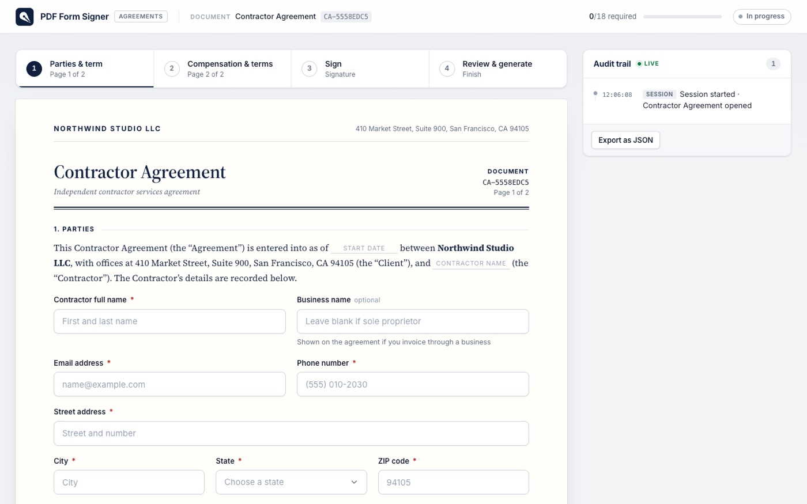

# PDF Form Signer: fill a form, draw a signature, download a real PDF



A browser-only document-signing app. A two-page **Contractor Agreement** is rendered as
paper-like HTML with 18 inline fields (text, email, phone, native date pickers, a state
dropdown, radio groups and checkboxes), inline validation, an initials pad on each page, a
signature step (freehand canvas with smooth strokes, undo, clear, and a typed-signature
fallback rendered in a bundled script typeface), a review step that lists every unfilled
required item, and **Generate PDF**, which uses [jspdf](https://github.com/parallax/jsPDF)
to build a real letter-size PDF containing every value, the signature and both initials as
images, plus a certificate page with the audit trail. A live **Audit trail** panel records a
timestamped event for every navigation, field commit, initials/signature stroke, validation
failure and PDF event, and can be exported as JSON.

Everything runs in the browser: no backend, no network calls at runtime, all assets bundled
(including the Inter and Dancing Script typefaces, see `src/fonts/FONTS.md`).

## Run it

```sh
cd pdf-form-signer
npm install
npm run dev      # http://localhost:5173
npm run lint     # oxlint
npm run build    # tsc -b && vite build
```

## Computer-use skill showcased

**Form filling, freehand signature drawing on a canvas, file download, and verifying the
downloaded artefact.** Devin drives the whole flow with a real mouse and keyboard: typing
into text/date fields, choosing from a `<select>`, clicking radios and checkboxes, drawing
initials and a cursive signature with mouse-down/move/up on a `<canvas>`, triggering and
fixing a validation error, clicking Generate PDF, and then checking the downloaded file in
`~/Downloads` from the shell with a PDF text extractor.

## Browser test scenario

1. Start the dev server and open `http://localhost:5173` in a maximised Chrome window.
2. **Page 1 – Parties & term:** fill contractor full name, business name, email, phone,
   street, city, state (dropdown), ZIP, start date and end date. Leave **Email address**
   empty on purpose. Draw initials in the page-1 initials box.
3. Click **Continue**. *Expected:* navigation is blocked, the email field shakes and shows
   an inline "Email address is required" error, a toast appears and a `validation` event is
   added to the audit trail.
4. Fill the email address and click **Continue** again. *Expected:* page 2 opens.
5. **Page 2 – Compensation & terms:** choose an engagement type (radio), enter the fee,
   choose payment terms (radio), tick the IP and confidentiality acknowledgements, tick the
   optional updates box, type additional terms, and draw initials in the page-2 box.
6. Click **Continue** to reach **Sign**. Draw a cursive signature with the mouse (several
   connected strokes), then pick the date signed.
7. Click **Review agreement**. *Expected:* a green "Everything is complete" banner,
   summary cards showing every entered value, and previews of the signature and both
   initials. The progress bar in the header reads 18/18.
8. Click **Generate PDF**. *Expected:* a `contractor-agreement-<name>.pdf` download starts,
   the panel shows page count, size and document ID, and `pdf` events are logged.
9. From the shell, confirm the file exists in `~/Downloads` and extract its text (e.g. with
   `pdftotext` or Python `pypdf`). *Expected:* the text contains the entered full name, the
   dates, and a "Certificate of completion" page listing the audit trail.
10. Show the audit trail panel: every step above appears with a timestamp.

## Recording

Recording: https://app.devin.ai/attachments/ba11739f-14a1-48f4-a223-37e969f81eb9/pdf-form-signer-redesign-e30d294-edited.mp4
