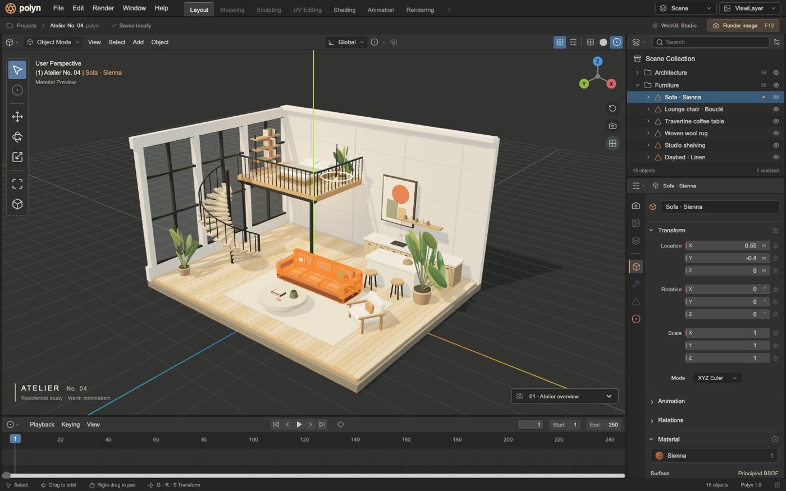

# Polyn



A Blender-inspired browser workspace opening directly into **Atelier No. 04**: a procedural architectural cutaway with a concrete shell, glazed window bays, oak mezzanine, sculptural spiral stair, kitchen, furnished living room, plants and warm lighting.

## Run

Node 22.12+ (verified with Node 24.19.0) and npm are required. No Python, backend, account or remote assets.

```sh
cd polyn
npm ci
npm run dev
```

Production: `npm run build && npm run preview`. Vite uses `base: './'` for subdirectory hosting.

## Edit

- Click geometry or an Outliner row. Its material and transform are shared across the viewport and Properties.
- Drag to orbit, scroll to zoom, right-drag to pan; Home resets the camera.
- G / R / S enables the corresponding gizmo. For exact edits: `G`, `X`, `1`, Enter moves one meter on X; `R`, `Z`, `30`, Enter rotates 30°; `S`, `2`, Enter doubles scale. Escape cancels numeric entry.
- Add cube/sphere/cylinder/plant; Shift D duplicates; Delete removes. Ctrl Z / Ctrl Shift Z undo/redo up to 60 edits.
- Material swatches, base color, roughness and metallic edit actual meshes. Solid and wireframe modes change actual materials.
- Insert transform keyframes with I. Change the frame, edit the object, insert again, and play with Space. Motion interpolates position, Euler rotation and scale at 24fps over frames 1–250.
- File → Export project downloads validated JSON, Open imports it, and all edits autosave locally. Saved cameras are included.
- Render image captures the current real WebGL view to a PNG, with selection, grid and gizmos removed.

See [TESTING.md](TESTING.md) for exact checks, browser workflow, references and limits.

## Reference and attribution

Reference family: **Blender 4.2 LTS manual, default dark Layout workspace**.

- https://docs.blender.org/manual/en/4.2/interface/window_system/introduction.html
- https://docs.blender.org/manual/en/4.2/editors/3dview/introduction.html
- https://docs.blender.org/manual/en/4.2/_images/interface_window-system_introduction_default-startup.png

The publicly accessible manual image was inspected before implementation. It is 1570×882 pixels: topbar ≈32 px, viewport header ≈33 px, left shelf ≈52 px wide, right editors ≈273 px, outliner ≈274 px high, timeline ≈94 px. Observed colors: near-#252525 topbar/outliner, #333333 viewport/header, #4A4A4A numeric fields, blue active controls, orange selected mesh edges. The manual's reused screenshot footer says “3.2.0 Alpha”; this is a limitation of that source asset rather than evidence of a separately inspected 4.2 installation.

Polyn follows this consistent layout language with 31 px topbar, 29 px viewport header, 32 px property tab strip, 22 px Outliner rows, 11–12 px text and 14–16 px control icons. It adds a 32 px project strip and architectural scene caption. Right editors are 288 px at 1440 and 320 px at 1920. These are documented adaptations, not a literal pixel-match claim.

Architecture and geometry are original procedural work. No Blender code, logo or bundled models are copied. The reference screenshot is retained only in untracked audit evidence. Blender documentation is © Blender Foundation, CC BY-SA; Blender is a trademark of Blender Foundation. Lucide icons are ISC-licensed, React and Three.js MIT-licensed. Polyn is independent and unaffiliated.
