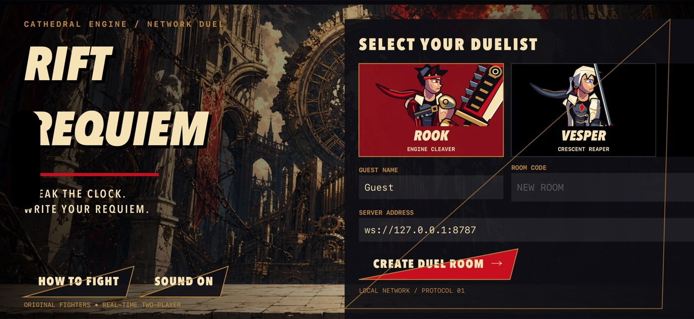

# Rift Requiem



A native landscape **iPhone / iPad** weapon fighter inspired by Guilty Gear Xrd
(2014). Two independently connected guests duel in the Cathedral Engine.
Original articulated fighters, a generated cathedral stage, a synthesized
metal riff, steel-hit foley, mechanical HUD, airborne movement and Requiem cancels.

**App:** Rift Requiem · **Bundle:** `ai.riftrequiem.duel` · **Port:** `8787`

## Build

Verified toolchain: Xcode 26.6 / iOS 26.5 simulator SDK, Node 22+, XcodeGen 2.46.0,
SwiftLint 0.65.1. Deployment target iOS 17. No Apple account needed for simulators.

```sh
cd rift-requiem
brew install xcodegen swiftlint
xcodegen generate
xcodebuild -project RiftRequiem.xcodeproj -scheme RiftRequiem \
  -sdk iphonesimulator -configuration Debug -derivedDataPath build \
  build CODE_SIGNING_ALLOWED=NO
```

Generated Xcode project is included; regeneration is only needed after changing
`project.yml`. No third-party Swift packages. Original audio assets are committed;
`python3 scripts/audio.py` deterministically regenerates them.

## Server and two-device play

```sh
cd server
npm ci
npm start
# Optionally PORT=8787 npm start
```

Choose two available iPhone simulators from `xcrun simctl list devices available`.
The examples below use placeholders; substitute your two **distinct** UUIDs:

```sh
xcrun simctl boot "$DEVICE_A"
xcrun simctl boot "$DEVICE_B"
open -a Simulator
xcrun simctl install "$DEVICE_A" build/Build/Products/Debug-iphonesimulator/RiftRequiem.app
xcrun simctl install "$DEVICE_B" build/Build/Products/Debug-iphonesimulator/RiftRequiem.app
xcrun simctl launch "$DEVICE_A" ai.riftrequiem.duel
xcrun simctl launch "$DEVICE_B" ai.riftrequiem.duel
```

Use landscape on both. In the first app enter a guest name, choose Rook or Vesper,
and create a room. Enter the displayed code on the second device, join, and press
Ready on both. Simulator loopback reaches the Mac's server. For physical LAN
devices, enter `ws://<Mac-LAN-IP>:8787`, allow Local Network access, and use the
same Wi-Fi. Physical device signing requires your own provisioning.

### Controls

| Control | Action |
|---|---|
| Hold ◀ / ▶ | Run left / right |
| ↑ | Jump |
| » | Ground dash, or one air dash per jump |
| Hold ◇ | Guard in facing direction; attacks prevent guard |
| S | Quick weapon slash |
| H | Heavy weapon swing, longer reach/recovery |
| SP | Travelling special projectile |
| RC | 25-meter neutral or 50-meter attack recovery cancel |
| Menu | Sound toggle, reconnect, return, leave |

Rook's broad engine cleaver is faster to read up close. Vesper's crescent scythe
has 20 extra units of melee reach. Both gain meter by advancing and trading hits.
Cancel recovery after a hit to extend pressure; a cancel slows the other fighter.
Win two rounds. On timeout, higher health wins. Both players must vote rematch.

## Checks

```sh
swiftlint lint --strict --config .swiftlint.yml
python3 -B -m unittest discover -s scripts -p 'test_*.py' -v
cd server && npm run check && npm test && npm audit
```

Python evidence lint (from the game directory):

```sh
python3 -m venv build/lint-venv
build/lint-venv/bin/python -m pip install ruff==0.13.0
build/lint-venv/bin/ruff check scripts/assert-evidence.py scripts/test_evidence.py
```

The Node suite checks hit startup/range, guard chip, sequence replay rejection,
air-dash restriction, cancel cost/recovery/slowdown, travelling projectiles,
round outcomes, real WebSocket two-guest state equality, room capacity, disconnect,
token reconnection, and rematch reset. Internal fixture mutation is confined to
unit/integration tests; recorded native automation never changes authoritative state.

Native UI smoke suite (run after a build with a booted destination):

```sh
xcodebuild -project RiftRequiem.xcodeproj -scheme RiftRequiem \
  -destination "platform=iOS Simulator,id=$DEVICE_A" -derivedDataPath build \
  test CODE_SIGNING_ALLOWED=NO
```

## Repeatable recorded duel

### macOS simulator audio

Establish a host audio endpoint **before** booting simulators. On a headless Mac:

```sh
brew install --cask blackhole-2ch
system_profiler SPAudioDataType
# Only if BlackHole is still missing and noninteractive sudo is authorized:
sudo -n killall coreaudiod
system_profiler SPAudioDataType
```

Verify BlackHole 2ch is the default input, output and system output at 48 kHz.
The tested VM needed one CoreAudio restart, not a VM reboot. Shut down and reboot
any simulators that were already running without an audio endpoint, then relaunch
the apps. If sudo is unavailable, have the host administrator restore CoreAudio.

For live loopback capture, SoX avoided audio-buffer loss seen with this VM's
combined FFmpeg AVFoundation screen/audio input:

```sh
brew install sox
sox -V3 -t coreaudio 'BlackHole 2ch' -r 48000 -c 2 -b 16 capture.wav
# Ctrl-C after the simultaneous screen capture ends.
```

Allow microphone access for the capture process if macOS asks. Stop unrelated
audio sources; BlackHole records all routed output. Record desktop video and
loopback audio concurrently. Use visible mute/unmute actions near both ends
to measure offset and drift before muxing the captured audio. Check sample count,
RMS/peak, absence of clipping, final audio/video durations and full decode.
Do not substitute the bundled music file for captured live audio.

### Automated two-peer match

Launch first guest with `-name Aria -fighter rook -connect 1 -auto 1 -evidence 1`.
Read its room code from UI or app Documents/state.json. Launch the second with
`-name Bram -fighter vesper -room CODE -connect 1 -auto 1 -evidence 1`.
Optional `-server ws://host:8787`. Both native apps visibly label automated input.

```sh
xcrun simctl launch "$DEVICE_A" ai.riftrequiem.duel \
  -name Aria -fighter rook -connect 1 -auto 1 -evidence 1
xcrun simctl get_app_container "$DEVICE_A" ai.riftrequiem.duel data
# Read Documents/state.json for the code, then:
xcrun simctl launch "$DEVICE_B" ai.riftrequiem.duel \
  -name Bram -fighter vesper -room "$CODE" -connect 1 -auto 1 -evidence 1
```

Start simultaneous `xcrun simctl io UUID recordVideo --codec=h264 output.mov`
captures before the second joins, or record the desktop with both complete
landscape simulators visible. Stop both after a best-of-three outcome and rematch.
Align simultaneous capture start offsets when composing; do not combine different
matches. Native evidence files belong to the exact recording run.

```sh
python3 scripts/assert-evidence.py left-network.jsonl right-network.jsonl \
  --output assertions.json
ffprobe -v error -show_format -show_streams duel.mp4
```

The evidence checker requires over 100 identical same-tick snapshots. A guest's
immediate join snapshot can share the previous broadcast tick: an otherwise
identical lobby changing from one to two players is reported separately in
`lobby_join_transitions`, never counted as agreement. Every other difference,
including changed existing-player fields or a combat roster change, fails.
The Python regression suite checks both this transition and divergence rejection.

To test real touch controls with the same peers, pause the driver independently:
`xcrun simctl openurl "$DEVICE_A" 'riftrequiem://auto?enabled=0'`.
Enable again with `enabled=1`. There are no URL hooks for scores or combat actions.
Physically tap/hold on-screen controls and verify authoritative movement/events.
Reconnect via the menu while the peer remains alive; both clients pause and resume.

## Architecture and limitations

SwiftUI owns the lobby, accessible native controls, HUD and results. SpriteKit
renders the generated stage plus source-authored articulated vector fighters,
weapon poses, interpolation, sparks, slash typography and cancel rings.
The fighter rig uses separate upper/lower limbs, two-bone inverse kinematics,
hand-anchored weapons and frame-driven anticipation, swing and recovery poses.
Curved silhouettes, layered light/shadow regions, facial features, costume seams,
metal bevels and independently moving coat tails are drawn in SpriteKit.
Combat actors share a uniform safe-area projection, keeping device cutouts away
from the arena boundaries without changing server coordinates or the HUD.
AVAudioPlayer plays original generated audio. Node owns all gameplay and rooms.
See [protocol](docs/PROTOCOL.md) and [reference observations](docs/REFERENCE.md).

This is an original approximation, not a licensed port and not pixel parity.
It does not reproduce Xrd's full roster, 3D cinematic cameras, frame-perfect
animation/physics, story, rankings or all advanced systems. Touch controls simplify
command inputs; both fighters currently share most frame data. Network rendering
has no rollback, prediction or lag compensation, and is intended for LAN play.
Guest progress lasts only for the server lifetime. Reconnect tokens live in app
memory; force-quitting loses the token. Forfeit requires a new room to find a new
opponent. No internet deployment, developer account or login is required.

The two-simulator evidence/report is attached to the PR and delivery message;
build success alone is not a claim of visual fidelity or verified multiplayer.
