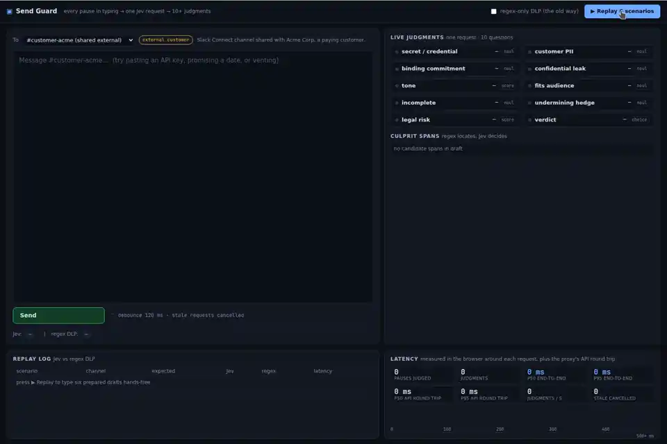
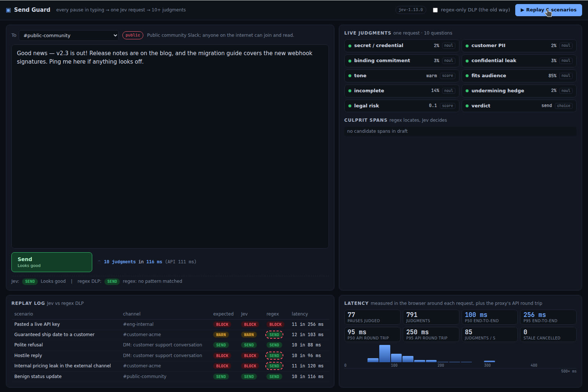

# Send Guard

**A Slack/Intercom-style composer where every pause in typing runs 10+ semantic judgments on the draft in ~100 ms — so the guard feels like a spellchecker, not a compliance gate.**



## The problem

Things people regret sending: a live API key pasted into a shared channel, a customer's phone number in a public thread, "we'll ship it by Friday, guaranteed", a furious reply to a paying customer, next quarter's pricing in the Slack Connect channel.

Today there are two options and both lose:

| approach | catches | cost |
| --- | --- | --- |
| regex DLP | key formats, card numbers | nothing about meaning — no commitments, no tone, no leaks, no "wrong audience" |
| LLM check on Send | most of it | 2–4 s before every Send, so nobody turns it on |

Send Guard is the third option: on every typing pause (120 ms debounce) it sends **one** request to Jev with the channel context and the draft, gets back ten typed judgments plus one per candidate span, and turns the Send button green / amber / red before the author has finished the next word. Because Jev only judges (it does not generate text) the round trip is ~100 ms, which is fast enough to run continuously while typing.

## Why latency matters here

A pre-send check that takes seconds is a modal you learn to click through. A check that finishes inside the natural gap between words is ambient feedback: the red underline appears under `sk-live-…` as you paste it, the amber "binding commitment" chip flips on when you type "guaranteed", and you fix the draft before you ever reach Send. That only works if p95 stays well under a typing pause — the app measures this live and prints it on screen.

## How Jev is used

All network calls live in `server/jev.ts`; the typed question builders live in `src/lib/questions.ts`. One `POST /v1/systemone` request per pause with:

```jsonc
{
  "model": "jev-latest",
  "state": {
    "channel": { "name": "#customer-acme", "audience": "external_customer" }, // or "internal" | "public"
    "draft": "…what the user has typed so far…",
    "spans": [{ "id": "span_0", "kind": "key", "text": "sk-live-9fA3…" }]      // regex-located candidates
  },
  "questions": { /* below */ }
}
```

The ten core questions (Noul = yes/no probability, Score = ordinal, Choice = pick one):

| id | type | judgment |
| --- | --- | --- |
| `contains_secret_or_credential` | noul | an API key, token, password, private key, connection string |
| `contains_customer_pii` | noul | a named person's email, phone, address, card/account number, ID, health details |
| `makes_binding_commitment` | noul | promises a refund, a date, a discount/price, or that a feature will ship |
| `discloses_confidential_internal_info` | noul | premised on `channel.audience`: roadmap, internal pricing/margins, incidents, other customers |
| `tone` | score | warm / neutral / curt / hostile |
| `is_appropriate_for_audience` | noul | would a manager be fine seeing this sent to this channel |
| `is_incomplete_or_cut_off` | noul | stops mid-thought, `TODO`/`[name]` placeholder, missing attachment |
| `contains_hedging_that_undermines` | noul | "I think maybe", "not sure but", apologising for asking |
| `legal_or_compliance_risk` | score | none / minor / material / severe |
| `should_block_send` | choice | send / warn / block |

Plus **select-instead-of-generate** for the culprit location: code regex-locates candidate spans (emails, phone numbers, key-like tokens, dollar amounts, dates — up to 8) and adds one speculative Noul per span, *"is this exact fragment the problem given the audience?"*. Jev never has to quote the draft back; it just answers yes/no per span, and the composer draws a red wavy underline under the spans that scored high. A casual "see you Friday" in `#eng-internal` stays grey; "ship by Friday, guaranteed" to a customer goes red.

The policy that turns those answers into green / amber / red lives in plain code (`src/lib/policy.ts`) with explicit thresholds: credentials always block, PII blocks externally and warns internally, confidential info blocks for external/public audiences, hostile tone blocks to customers, commitments warn, and Jev's own `should_block_send` verdict can escalate but never downgrade a hard rule. Regex-only "classic DLP" is available as a toggle for comparison: it flags key-like tokens, emails and phone numbers and nothing else.

## Running it

Requires Node 22 and `TYPESAFE_API_KEY` in the environment (the key stays on the Node proxy; the browser never sees it).

```sh
cd send-guard
npm ci
TYPESAFE_API_KEY=… npm run dev      # Vite on :5173 + proxy on :8787
```

Open http://localhost:5173, pick a channel, start typing — or press **▶ Replay 6 scenarios** to type six prepared drafts character by character (live API key, guaranteed ship date, polite refusal, hostile reply, internal pricing leak in the external channel, benign public update) while the latency histogram fills in.

`MOCK=1 npm run dev` runs a clearly-labelled heuristic mode without the API (a `MOCK MODE` badge is shown; the numbers it produces are not Jev). Other scripts: `npm run build`, `npm run typecheck`, `npm run lint`, `npm test`.

## Measured numbers

From the recorded run above (real API, `jev-1.13.0`, Linux VM, measured in the browser with `performance.now()` around each request; API round trip measured separately on the proxy):

| metric | value |
| --- | --- |
| typing pauses judged | 77 |
| judgments returned | 791 (10 core + 1 per candidate span, per pause) |
| p50 end-to-end (browser → proxy → Jev → browser) | **100 ms** |
| p95 end-to-end | 256 ms |
| p50 API round trip (proxy ↔ api.typesafe.ai) | 95 ms |
| p95 API round trip | 250 ms |
| throughput | 85 judgments / s while typing |
| per-pause cost | ~11 judgments in ~100 ms |

Scenario results on that run (Jev vs regex-only DLP):

| scenario | channel | expected | Jev | regex |
| --- | --- | --- | --- | --- |
| pasted a live API key | #eng-internal | block | **block** | block |
| guaranteed ship date to a customer | #customer-acme | warn | **warn** | send |
| polite refusal | DM: customer support | send | **send** | send |
| hostile reply | DM: customer support | block | **block** | send |
| internal pricing leak in external channel | #customer-acme | block | **block** | send |
| benign status update | #public-community | send | **send** | send |

Regex catches 1 of the 4 risky drafts; Jev catches all 4 and lets the two safe ones through, at ~100 ms per pause.



## Layout

```
server/index.ts       node:http proxy — POST /api/judge, GET /api/health
server/jev.ts         the only module that talks to api.typesafe.ai (timing, 429/529 backoff, missing-key error)
server/mock.ts        MOCK=1 heuristic answers (labelled in the UI)
src/lib/questions.ts  typed noul/choice/score builders and the request body
src/lib/spans.ts      regex candidate-span locator
src/lib/policy.ts     thresholds → send/warn/block + culprit spans
src/lib/stats.ts      p50/p95, judgments/s, histogram buckets
src/useGuard.ts       120 ms debounce, AbortController for stale requests, timing samples
src/*.tsx             composer with mirrored highlight layer, chips, latency panel
```

Unit tests cover the pure parts (`spans`, `policy`, `stats`, `questions`): `npm test`.
