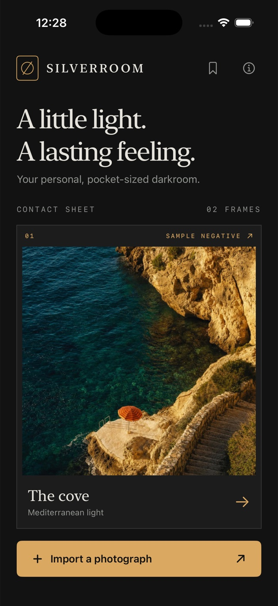

# Silverroom



A native, on-device photo darkroom for iPhone. SwiftUI provides the interface;
Core Image develops real photographs. No runtime dependencies, accounts,
backend, or API keys.

## Features

- An editorial contact sheet with two original, AI-generated sample photographs.
- Import through the system Photos picker; the selected original is copied into
  the app's Documents directory. No broad Photos read permission is required.
- Five carefully composed looks: Original, Silver, Noir, Dune, and Faded.
  Each filmstrip thumbnail previews the active photograph.
- Exposure (−2…+2 EV), contrast (0.5…1.5), and warmth (−100…+100).
- Hold to compare with the unedited original; VoiceOver can toggle comparison.
- Clockwise rotation, centered square crop, original ratio, and confirmed reset.
- Save, apply, rename, and delete editing recipes. A recipe includes the look
  and adjustments; crop and orientation belong to the individual photograph.
- Full-resolution JPEG export through the system share sheet (Photos, Files,
  AirDrop, and available share extensions). Preview rendering is downsampled;
  export always uses the original pixel data.

## Open and build

Open `Silverroom.xcodeproj` and select the shared **Silverroom** scheme and an
iPhone simulator. The committed project opens directly without setup.

Tested with Xcode 26.6 (17F113), Swift 6.3, and iOS 26.5 simulators on macOS
arm64. Deployment target is iOS 17 (SwiftUI sensory feedback and modern
onChange APIs). The app is iPhone portrait only.

```sh
# From silverroom:
xcodebuild -project Silverroom.xcodeproj -scheme Silverroom \
  -destination 'platform=iOS Simulator,name=iPhone 17 Pro' \
  -derivedDataPath "$HOME/silverroom-build" CODE_SIGNING_ALLOWED=NO build

xcodebuild -project Silverroom.xcodeproj -scheme Silverroom \
  -destination 'platform=iOS Simulator,name=iPhone 17 Pro' \
  -derivedDataPath "$HOME/silverroom-build" CODE_SIGNING_ALLOWED=NO test

xcrun swift-format lint --strict --recursive Silverroom SilverroomTests Scripts
```

If changing the project structure, regenerate with XcodeGen 2.46.0:

```sh
brew install xcodegen
xcodegen generate
```

The icon is original procedural Core Graphics artwork. To regenerate:

```sh
xcrun swift Scripts/GenerateIcon.swift Silverroom/Assets.xcassets/AppIcon.appiconset/AppIcon.png
```

## Controls and data

Tap a contact-sheet frame to edit it. Changes save automatically; Back returns
to the library. **Looks** changes the film, **Adjust** exposes the three sliders,
and **Frame** rotates or crops. Hold the comparison row to see the original.
Holding the photograph also compares. Each adjustment has a **Neutral** reset.
At accessibility text sizes, the adjustment selector becomes a menu and frame
and recipe actions stack vertically; the darkroom toolbar remains fixed.
The bookmark opens recipes; **Save recipe** names the current settings.
Recipe previews include all saved adjustment values; deletion requires confirmation.
Long-press an imported photograph in the library to remove its local copy.

The pipeline applies EXIF orientation once, then exposure, temperature, film
saturation/contrast, tone curve, rotation, and centered crop. Parameters clamp
at their limits. Rendering converts to sRGB. Export does not include original
GPS or camera metadata. Originals are never overwritten. Library metadata and
recipes are JSON saved atomically inside the app sandbox. Deleting the app
deletes this local library; there is no sync or account recovery.

## Scope and limitations

- JPEG/HEIC/PNG imports supported by ImageIO. RAW workflows, Live Photo motion,
  video, layer editing, selective masks, and arbitrary crop positioning are
  outside V1.
- A square crop is centered, not draggable. Export is a 96%-quality sRGB JPEG,
  not an HDR, wide-gamut, or lossless master.
- Built-in photos are 1024 × 1536 original generated demo assets, clearly marked
  as samples. User photographs retain their own full export resolution.
- iOS 17 deployment compatibility is compiler-checked; runtime UI validation
  uses installed iOS 26.5 simulators. Physical hardware, production signing,
  and App Store submission are not part of this build.
- Original imports and generated exports consume local storage. Exports remain
  in the app sandbox; V1 does not include automatic export-cache cleanup.
