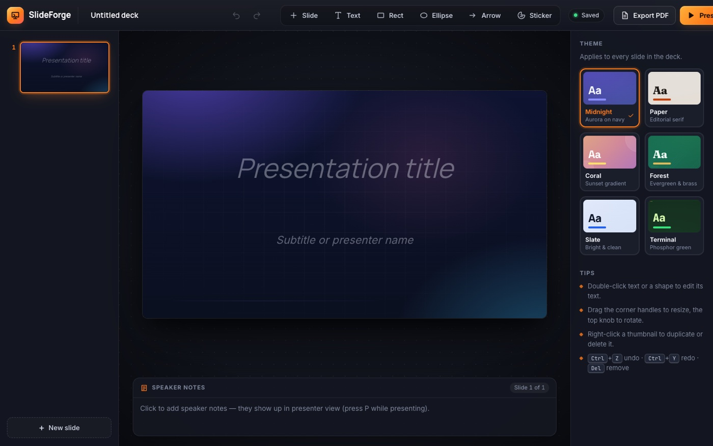

# SlideForge: build a deck, present it fullscreen, export a PDF



A Google-Slides-lite editor that runs entirely in the browser. Slides live in a
thumbnail rail on the left (drag to reorder, right-click to duplicate/delete);
the 16:9 canvas holds text boxes, rectangles, ellipses, arrows and emoji
stickers that can be moved, resized and rotated with handles. A properties
panel edits fill, font size and alignment, six built-in themes restyle the
whole deck, every slide has speaker notes, and the deck autosaves to
`localStorage` with full undo/redo.

**Present** enters fullscreen (Fullscreen API) with arrow-key navigation;
pressing `P` toggles a presenter view with the current slide, the next slide,
speaker notes and a running timer. **Export PDF** opens the browser's print
dialog on a print-only layout that puts exactly one 16:9 slide per page, so
"Save as PDF" produces a real slide deck.

## Run it

```bash
cd slide-forge
npm install
npm run dev      # http://localhost:5173
npm run lint     # oxlint
npm run build    # tsc -b && vite build
```

No backend, no network calls, no external assets: everything is bundled and the
deck persists in `localStorage` under `slide-forge:deck`.

## Design

Each theme is a small design system, not just a colour swap: a base colour plus
a decorative layer (aurora glow, paper rule, sunset blobs, phosphor grid, ...)
and its own heading face. Fonts are bundled variable fonts from Fontsource
(Inter, Manrope, Fraunces, Space Grotesk, JetBrains Mono) and stickers are
bundled Twemoji SVGs, so slides render identically in the editor, in fullscreen
Present mode and in the exported PDF regardless of the OS font stack.

## Computer-use skill showcased

**Rich WYSIWYG editing, drag-to-reorder thumbnails, fullscreen presenting, and
the browser print dialog.** The scenario exercises contenteditable text,
pointer-driven drag/resize/rotate handles, a custom context menu, a fullscreen
presentation driven by keyboard, and Chrome's native print dialog with
"Save as PDF" - then verifies the resulting file from the shell.

## Browser test scenario

Recording: **https://app.devin.ai/attachments/908c167a-d144-4904-aedd-6e2d1643ca8f/slide-forge-redesigned-showcase-edited.mp4**

Start with `npm run dev`, open the app in a maximised Chrome window, then:

| # | Step | Expected result |
|---|------|-----------------|
| 1 | Click the deck title and type `Why Devin Should Run Your QA`; double-click the title text box on slide 1 and type the same title, then edit the subtitle. | Title slide shows the new title; the rail thumbnail and "Saved" indicator update. |
| 2 | `+ Slide` → **Title + bullets**; type a heading and three bullet lines. | A second slide with a heading and a bulleted list appears in the rail. |
| 3 | `+ Slide` → **Blank**; insert **Rect**, **Ellipse**, **Rect** and an **Arrow**; drag them into a left-to-right flow and drag a corner handle to resize one shape. | Three shapes and an arrow arranged as a diagram; the properties panel shows fill swatches and X/Y/W/H for the selection. |
| 4 | `+ Slide` → **Section**; type a closing line and add speaker notes. | Fourth slide with closing text; the notes panel shows the note. |
| 5 | Drag slide 4's thumbnail above slide 3. | Drop indicator appears while dragging; the rail reorders to 1, 2, 4, 3. |
| 6 | Right-click slide 2 → **Duplicate slide**, then right-click the duplicate → **Delete slide**. | Deck briefly has 5 slides, then returns to 4. |
| 7 | Deselect everything and pick the **Coral** theme in the properties panel. | All slides and thumbnails restyle instantly. |
| 8 | Click **Present**; press `→` through all slides, `P` for presenter view, `Esc` to exit. | Chrome goes fullscreen, slides advance 1→4, presenter view shows notes + timer, `Esc` returns to the editor. |
| 9 | Click **Export PDF**, choose **Save as PDF**, save into `~/Downloads`. | Print preview shows 4 pages, one slide per page. |
| 10 | In a shell run `pdfinfo ~/Downloads/why-devin-should-run-your-qa.pdf`. | `Pages: 4`. |
