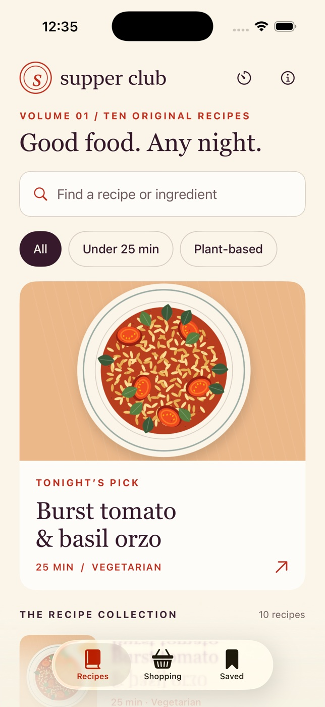

# Supper Club



A native, offline iPhone cooking companion, styled as a small food magazine. Built with SwiftUI, Canvas and Foundation. iOS 17+, no packages, servers, accounts or API keys.

## Features

- Ten original recipes with procedural food illustrations, ingredient search and quick/vegan filters.
- Save favorites; scale recipes from 1–12 servings, including fractional quantities.
- A persistent shopping list that combines ingredients with the same name and unit. Adding the same recipe again replaces that recipe's quantities, rather than duplicating them. Re-scaling unchecks changed quantities.
- Create, edit, delete and check off your own extras. Remove individual recipes or clear the list with confirmation.
- Full-screen, step-by-step cook mode, ingredient reference, previous/restart/close/resume and a finished-meal screen.
- Named timers with custom duration, pause, resume, reset and restart. Deadlines persist across app closure. Visual and haptic completion cues while the timer is on screen.
- VoiceOver labels for controls, Dynamic Type editorial and body text, high contrast, 44-point or larger controls, no essential animation, portrait iPhone layout.

## Open and run

Open `SupperClub.xcodeproj`, select the shared **SupperClub** scheme and an iPhone simulator, then Run. No signing team is needed for the simulator. Device builds require your own Apple signing setup.

To reproduce the project:

```sh
brew install xcodegen
xcodegen generate
```

The generated project is committed. XcodeGen 2.46.0 and Xcode 26.6 were used. The minimum iOS 17 target supports SwiftUI's observation-of-value change API used for timer completion cues.

From this directory:

```sh
xcodebuild -project SupperClub.xcodeproj -scheme SupperClub \
  -sdk iphonesimulator -destination 'platform=iOS Simulator,name=iPhone 17 Pro' \
  -derivedDataPath "$HOME/supper-club-build" CODE_SIGNING_ALLOWED=NO build

xcodebuild -project SupperClub.xcodeproj -scheme SupperClub \
  -destination 'platform=iOS Simulator,name=iPhone 17 Pro' \
  -derivedDataPath "$HOME/supper-club-build" CODE_SIGNING_ALLOWED=NO test

xcrun swift-format lint --strict --recursive SupperClub SupperClubTests Scripts
```

Re-render the original app icon with `swift Scripts/GenerateIcon.swift`. The food illustrations are drawn entirely with SwiftUI Canvas. No external imagery or fonts are needed.

## Controls and data

Search accepts any number of words (or comma-separated words), matching all of them against recipe titles and ingredients. “Plant-based” displays the four vegan recipes; dietary labels are based on the written ingredients and do not imply allergen safety.

Serving controls update amounts immediately and persist per recipe. Shopping contributions update when **Add to list** is tapped. The list intentionally does not convert between unlike units. Extra items use free text so quantities or notes can be included. Exact duplicate extra names are ignored, case-insensitively.

Closing cook mode saves the current step. Starting a different recipe replaces the resumable recipe; existing timers remain available in the timer room. Finishing a recipe increments the local supper count. Timers are independent of cook progress and are never silently canceled by finishing or leaving a recipe.

All state is stored in the app's local UserDefaults as a Codable record. Nothing is transmitted. Removing the app deletes its data; there is no sync or export.

## Scope and limitations

- Timers track real wall-clock deadlines but do not send background notifications or make sounds. Open the timer room or relevant cook step for visible completion and foreground haptics. Changing the system clock affects deadlines.
- Recipe instructions mention base water amounts where needed and explain that these should scale with servings. Large batches may need multiple pans. Timings are guidance; meat/fish instructions include safe internal temperatures.
- Editorial and body text scale with Dynamic Type; decorative metadata stops at XXXL to preserve hierarchy. Serving controls stack at accessibility sizes. The logo and timer digits retain stable sizes. No landscape or iPad-specific composition is promised.
- No physical-device validation, production signing, App Store submission, nutrition estimates, allergen filtering, recipe import or cloud services are included.
- Unit tests cover fractions, ingredient search/catalog integrity, deduplication/rescaling, state restoration, custom items, serving bounds, timer deadlines/pause/reset, and cooking progress.
