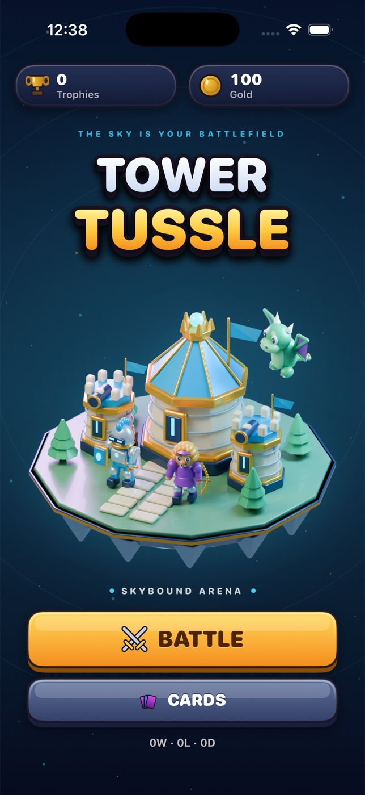

# Tower Tussle



A real-time card/tower battle game in the spirit of Clash Royale, built twice from
scratch: a native iOS app (Swift 5.9, SwiftUI, `Canvas`) and a native Android app
(Kotlin, Jetpack Compose). Both share the same rules, card roster, arena layout and
visual language; neither uses any Supercell code, art, fonts or names.

## Gameplay

- 18x32 logical arena, river across the middle, two bridges. Player deploys troops on
  the lower half; spells can land anywhere.
- Two guard towers plus a central keep per side. Destroying a tower earns a crown;
  destroying the keep is an instant 3-crown win.
- Elixir starts at 5, regenerates continuously, caps at 10. Double elixir in the last
  regulation minute; 3:00 regulation then 1:00 sudden-death overtime.
- 4-card hand with a next-card preview; 10-card roster (Knight, Archers, Colossus,
  Duelist, Sharpshooter, Gremlins, Bone Brigade, Whelp, Meteor, Volley).
- Enemy AI deploys troops and cluster-targets spells.
- Trophies, gold, W/L/D record and deck composition persist across launches
  (UserDefaults / SharedPreferences). Surrendering counts as a 3-crown defeat.

## iOS

```sh
cd ios
xcodegen generate               # regenerates TowerTussle.xcodeproj from project.yml
xcodebuild -project TowerTussle.xcodeproj -scheme TowerTussle -sdk iphonesimulator \
  -destination 'platform=iOS Simulator,name=iPhone 17' -derivedDataPath build build
xcrun simctl boot "iPhone 17"
xcrun simctl install booted build/Build/Products/Debug-iphonesimulator/TowerTussle.app
xcrun simctl launch booted com.dabit3.towertussle
```

## Android

Requires JDK 17 and an Android SDK with platform 35 (`sdk.dir` in `android/local.properties`
or `ANDROID_HOME`). `settings.gradle.kts` lists Google's Maven Central mirror ahead of
Maven Central to avoid rate limiting.

```sh
cd android
./gradlew assembleDebug testDebugUnitTest lintDebug
emulator -avd TowerTussle &          # any API 26+ AVD
adb install -r app/build/outputs/apk/debug/app-debug.apk
adb shell am start -n com.dabit3.towertussle/.MainActivity
```

`app/src/test` holds JVM unit tests for the battle engine (hand cycling, elixir,
deployment rules, timers, surrender, crowns).

## Graphics

The **Skybound** design uses original 3D models rendered in Blender: a floating
castle island, ten illustrated card portraits, eight animated troop atlases
(six poses per team), four towers, an arena, a crown emblem, and matching app
icons. Lagoon enamel, coral opponents, champagne gold, emerald grass, and a
midnight starfield unify the native screens.

- `RenderedArt`: cached native images/atlas frames; Android and iOS ship identical
  PNG resources. No runtime rendering service or network access is needed.
- `ArenaCanvas`: the rendered battlefield and y-sorted troops/towers, with live
  water, team rings, flight motion, hit flashes, projectile arcs, spell effects,
  particles, health bars, and merged damage numbers.
- `Widgets` / Home / Results: illustrated cards, floating hero island, starfield,
  illuminated rings, beveled controls, reward panels, and sculpted crown.
- `ArcadeAudio`: original synthesized navigation, deployment, victory, and defeat
  cues using native audio APIs. iOS also provides selection/deployment haptics.

See [art/README.md](art/README.md) for the reproducible modeling/packaging pipeline,
tool versions, atlas layout, and asset checksums. Blender/Python are development
tools only; both applications build directly from the committed resources.

## Test identifiers

Both apps expose the same identifiers (iOS `accessibilityIdentifier`, Android `testTag`):
`battleButton`, `cardsButton`, `backButton`, `resetDeckButton`, `avgElixir`, `deck-<id>`,
`collection-<id>`, `quitButton`, `timer`, `playerCrowns`, `enemyCrowns`, `nextCard`,
`hand-0..3`, `elixirBar`, `arena`, `announcement`, `resultTitle`, `rematchButton`, `homeButton`.

## Clone workflow

Built with the `clone-this` workflow; run state and evidence live in
`.devin/clone-this/tower-tussle/`. Because no authorized Clash Royale source or binary
was available, the source audit records inferred requirements and the visual parity
check is explicitly blocked rather than claimed.
