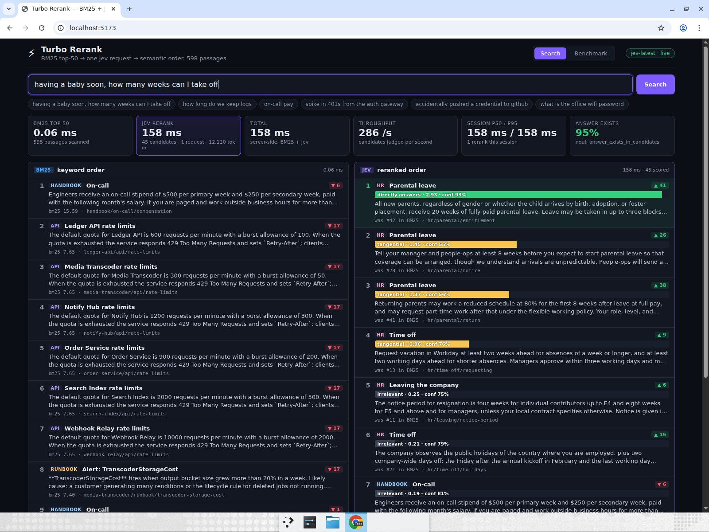
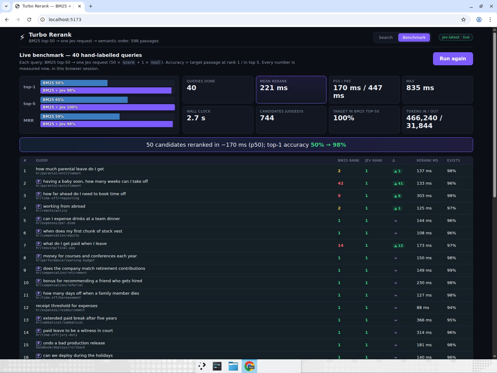

# Turbo Rerank

**50 search candidates semantically reranked in one ~170 ms Jev request — top-1 accuracy 50% → 100% on a 40-query labelled benchmark.**




## The problem

Keyword search (BM25) is fast and usually gets the right document *somewhere* in the top 50 — but rarely at #1, and it falls apart on paraphrases that share no words with the target ("having a baby soon, how many weeks can I take off" vs. a passage titled *Parental leave entitlement*). The usual fixes are expensive:

| approach | latency per query | infra |
|---|---|---|
| cross-encoder reranker | 50–300 ms | GPU, model serving |
| LLM "rank these passages" prompt | 2–10 s, parse the text back | prompt engineering, output parsing |
| **BM25 top-50 → one Jev request** | **~170 ms (p50), 1 HTTP call** | none |

Because Jev answers many independent questions about the same state in one round trip, judging 50 candidates costs the same as judging one. That makes reranking cheap enough to run on *every* keystroke — this demo does search-as-you-type with a 250 ms debounce.

## How Jev is used

`server/jev.ts` → `shared/questions.ts` builds exactly one `systemOne` request per search:

```ts
state = { query, candidates: { c01: "<passage text>", c02: "...", ... c50: "..." } }

questions = {
  relevance_c01: score(
    "How well does the documentation passage `candidates.c01` answer the search query `query`? Judge only this passage on its own; ignore the other candidates.",
    ["Irrelevant: ...", "Tangential: ...", "Partially answers: ...", "Directly answers: ..."]),
  ...one per candidate...
  answer_exists_in_candidates: noul(
    "Does at least one of the passages in `candidates` directly answer the search query `query`?",
    { true: "At least one candidate passage contains the specific information the query asks for.",
      false: "No candidate passage answers the query; the closest ones are only on a related topic." }),
}
```

- Each `score` answer is a probability distribution over the four levels; the code computes an expected relevance `Σ p·level ∈ [0,3]` and sorts by it (ties broken by BM25 order). Jev never generates text — all ordering, rank deltas and metrics are plain code.
- The `noul` drives the **"No good answer in the corpus"** banner (shown when `P(true) < 0.5`), so the UI can stop pretending the top result is an answer.
- All 50 questions go in **one request** (`RERANK_BATCHES=1`). Set `RERANK_BATCHES=2` or `3` to split into parallel requests instead; measured, one request of ~14k input tokens is fine and fastest.
- The SDK client retries 408/429/5xx/529 with exponential backoff; a missing `TYPESAFE_API_KEY` yields a clear 500 and a red pill in the UI.

## Run it

```sh
cd turbo-rerank
npm ci
export TYPESAFE_API_KEY=...   # server-side only, never shipped to the browser
npm run dev                   # Node proxy on :8787 + Vite on :5173 (proxies /api)
npm run bench                 # CLI benchmark, same 40 queries
```

`MOCK=1 npm run dev` / `npm run bench -- --mock` runs an offline token-overlap stub (clearly labelled **MOCK MODE** in the UI and CLI; its numbers are meaningless). Default is the live API.

`npm run lint`, `npm run typecheck`, `npm run test` (16 vitest tests: BM25, request/answer parsing, ranking merge, corpus integrity, every benchmark target retrievable in top-50), `npm run build`.

## Measured results

`npm run bench`, 40 hand-labelled queries (25 of them paraphrases), 598-passage corpus, model `jev-latest`, from a Linux VM:

| | BM25 | BM25 + Jev |
|---|---|---|
| top-1 accuracy | 50% | **100%** |
| top-5 accuracy | 65% | **100%** |
| MRR | 0.589 | **1.000** |
| paraphrase queries top-1 (n=25) | 64% | **100%** |

| rerank latency (50 candidates, one request) | |
|---|---|
| mean | 189 ms |
| p50 | 167 ms |
| p95 | 302 ms |
| max | 328 ms |
| 40 queries wall clock (4 concurrent) | 2.0 s → **1,008 candidates judged/s** |
| tokens | 466k input / 32k output for the whole run |

A second run from the browser's Benchmark tab (screenshot below) measured top-1 50% → 98% (39/40), top-5 65% → 100%, mean 221 ms, p50 170 ms, p95 447 ms, 2.7 s wall clock — Jev's judgments are probabilistic, so expect 98–100% top-1 and a p50 around 170 ms run to run, with occasional 500–800 ms outliers.



BM25 itself takes 0.05–0.3 ms per query over the 598 passages (~5 ms on the very first, un-JITed call).

Biggest jumps in the run: *"having a baby soon, how many weeks can I take off"* #42 → #1, *"on-call pay"* #41 → #1, *"how long do we keep logs"* #33 → #1, *"removing old feature flags"* #31 → #1, *"accidentally pushed a credential to github"* #28 → #1.

Sanity check on the Noul: *"what is the office wifi password"* (not in the corpus) → `answer_exists_in_candidates` = 0.03, banner shown; benchmark queries score 0.85–0.99 except a few where the target only partially answers (e.g. *"my phone was stolen"* → 0.43, the passage is about lost/stolen laptops and phones but the query is thin).

## Corpus & benchmark

`shared/corpus/` builds 598 passages in code at startup (deterministic, seeded PRNG, no external data, no real PII) for the fictional company **Northwind**:

- 66 engineering-handbook sections (code review, CI, deploys, incidents, on-call, secrets, access, databases, API design, observability, laptops) — hand-written
- 41 HR policy passages (leave, remote work, expenses, performance, compensation, hiring, conduct, leaving) — hand-written
- 491 generated passages for 12 fictional services (Ledger API, Auth Gateway, Notify Hub, …): endpoint reference, error codes, alert runbooks, feature flags, architecture, retention, scaling, changelogs — generated from structured specs with varied phrasing so many passages share vocabulary (rate limits, retries, 401s, lag…) and keyword search has plenty of plausible-looking distractors.

`shared/bench-queries.ts` holds the 40 query → target-id pairs; the `P` badge marks paraphrases that share few or no keywords with the target passage.

## Layout

```
server/index.ts     node:http proxy: /api/bm25, /api/search, /api/bench (SSE), /api/health
server/jev.ts       the only module that talks to TypeSafe (@typesafe-ai/sdk, retries, batching, timing)
server/mock.ts      offline stub for MOCK=1
shared/bm25.ts      BM25 with tokenizer/stemmer (tests in bm25.test.ts)
shared/questions.ts typed question builders + answer parsing (tests in rerank.test.ts)
shared/rerank.ts    merge Jev answers with BM25 hits, percentiles
shared/bench.ts     benchmark runner + summary math (shared by CLI and server)
shared/corpus/      corpus generator
src/                React 19 UI: search (two columns, rank arrows, relevance bars, latency panel) + benchmark tab
bench.ts            `npm run bench` CLI
```
