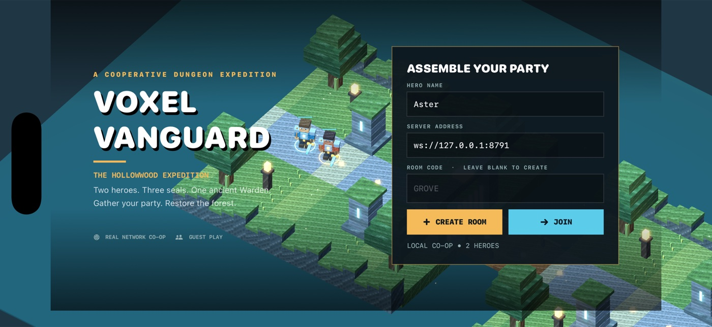

# Voxel Vanguard



A native landscape **iPhone** cooperative voxel dungeon crawler inspired by
Minecraft Dungeons Arcade (2021). Two distinct guests explore the Mossgate,
cross suspended bridges into the Sundered Crypt, collect gear cards and defeat
the Hollow Warden together. All game state is authoritative on a local server.

**App:** `games.vanguard.voxel.ios` · **Server:** `ws://127.0.0.1:8791`

## Requirements and build

Verified toolchain: macOS, Xcode 26.6, iOS 26.5 simulator runtime, Swift 6.3.3,
Node 24.19.0. The deployment target is iOS 17. No Apple account is needed for
simulator builds. The committed Xcode project is self-contained; XcodeGen 2.46.0
is only needed to regenerate it after changing `project.yml`.

From this directory:

```sh
npm --prefix Server ci
npm --prefix Server run check
npm --prefix Server test
npm --prefix Server audit
xcrun swift-format lint --strict -r App
xcodebuild -project VoxelVanguard.xcodeproj -scheme VoxelVanguard \
  -configuration Release -sdk iphonesimulator \
  -destination 'generic/platform=iOS Simulator' \
  -derivedDataPath build CODE_SIGNING_ALLOWED=NO build
```

Open `VoxelVanguard.xcodeproj` in Xcode to build/run interactively. To regenerate:
`xcodegen generate`. No root files or other game folders are involved.

## Local server and two iPhones

Start the server in its own terminal:

```sh
npm --prefix Server start
```

Use two available device IDs from `xcrun simctl list devices available`. Replace
`DEVICE_A` and `DEVICE_B` below with different simulator UUIDs:

Before booting, verify the Mac has a working audio output with
`system_profiler SPAudioDataType`. See [audio capture](#audio-capture-on-macos-vms)
for headless hosts; simulators booted without an endpoint may need restarting.

```sh
xcrun simctl boot DEVICE_A
xcrun simctl boot DEVICE_B
open -a Simulator
xcrun simctl bootstatus DEVICE_A -b
xcrun simctl bootstatus DEVICE_B -b
xcrun simctl install DEVICE_A build/Build/Products/Release-iphonesimulator/VoxelVanguard.app
xcrun simctl install DEVICE_B build/Build/Products/Release-iphonesimulator/VoxelVanguard.app
xcrun simctl launch DEVICE_A games.vanguard.voxel.ios
xcrun simctl launch DEVICE_B games.vanguard.voxel.ios
```

On the first iPhone, enter a guest name and select **Create room**. On the second,
enter another name and the first phone's displayed room code, then **Join**.
Both select **Ready for expedition**. A room accepts exactly two human peers.

For LAN devices, change the editable server address on both devices to
`ws://YOUR_MAC_LAN_IP:8791`. The server binds `0.0.0.0`. Allow local-network
permission and TCP 8791 in the host firewall. No public service is deployed.
Physical iOS device installation requires your usual signing setup.

## Controls and rules

| Control | Effect |
|---|---|
| Left joystick | Move in screen-relative directions through the 3D dungeon |
| Hold MELEE | Auto-face the nearest enemy and cleave within sword reach |
| Hold RANGE | Fire physical projectiles toward the nearest foe |
| DODGE | Roll in the movement/facing direction; brief invulnerability |
| HEAL | Restore 48 health; 15-second cooldown |
| Hold REVIVE | Stand within 2.8 units of a fallen ally for 2.5 seconds |
| Gear cards | Inspect inventory; choose one card per hero at each cleared cache |
| RELIC | At 100% charge, unleash a damaging thunder ring |
| Reconnect | Resume the same hero after a transient socket disconnect |
| Rematch | Both heroes ready again; reset health, gear, enemies and scores |

Melee, ranged and dodge are the primary arcade-inspired controls. Gems are
collected by proximity. Gems and hits fill the relic meter. Gear changes actual
damage, attack cooldown, maximum health or damage resistance. Each cache offers
Sun Cleaver, Storm Blade, Ember Bow, Swift Bow and Warden Mail. Each hero chooses
independently; one hero cannot consume the other's card.

The first two seals open only when their enemy encounter is defeated. The
golden trail crosses each bridge. Enter the next courtyard to activate its
encounter. The boss telegraphs a five-unit slam with a red ring for 1.4 seconds.
Both heroes down means defeat; defeating the Warden means shared stage
completion. Foes are explicitly AI; neither player is replaced with a fake peer.

## Repeatable automated two-device test

For actual Devin computer-tool gestures on both native UIs, use the
[computer-use scripts and instructions](Scripts/computer-use/README.md).
They provide live window calibration, gesture payloads, action traces, read-only
assertions and concurrent desktop/audio capture. A Devin session dispatches each
payload through its computer tool and checks the resulting UI.

The optional **AUTOMATED INPUT** driver exists only when `-automation` is supplied.
It reads the same snapshots as the HUD and calls the same movement/action sender
as touch controls. It cannot set position, health, scores, loot or outcome.

```sh
# Start the server with a same-run machine-readable state log.
LOG_PATH="$PWD/evidence/server.jsonl" npm --prefix Server start
# Create evidence/ first; it is intentionally ignored by Git.

xcrun simctl launch DEVICE_A games.vanguard.voxel.ios \
  -host -room GROVE -name Aster -automation -autoRematch
xcrun simctl launch DEVICE_B games.vanguard.voxel.ios \
  -join -room GROVE -name Bramble -automation -autoRematch
```

Launch the host before the joiner. `-server ws://HOST:8791` overrides the address.
The driver readies both players, navigates collision-aware paths, mixes melee/
ranged/dodge, heals, revives a downed ally when needed, chooses equipment, crosses
bridges and attacks the boss. `-autoRematch` readies once after the first result
has remained visible for nine seconds; omit it to stop at the first result.
The **AUTO DRIVER** button disables it for manual control testing.

Record both simulator streams simultaneously using `simctl io DEVICE recordVideo`.
Compose the synchronized streams side by side without cropping either device.
Do not present different runs as a simultaneous match. The app labels automated
steps in the HUD. Each simulator writes `Documents/vanguard-evidence.jsonl`;
retrieve its container with:

```sh
xcrun simctl get_app_container DEVICE_A games.vanguard.voxel.ios data
curl http://127.0.0.1:8791/rooms/GROVE
```

The room endpoint is read-only observation, not an automation backdoor. To test
touch input, disable the driver, drag the joystick, hold Melee/Range, tap Dodge,
then inspect position/action counters and the moving scene. To test reconnect,
tap **Reconnect** and verify the same full player UUID returns without duplicate
heroes. Run the machine log assertion tool after the session:

```sh
node Scripts/assert-evidence.mjs evidence/server.jsonl
```

It requires two distinct peers, both ready, meaningful input/hits from both,
all three stages, equipment, shared victory and a rematch. It does **not** replace
visual/manual inspection or prove that a recording exists.

### Audio capture on macOS VMs

The verified VM setup uses BlackHole 2ch 0.7.1 for actual loopback capture:

```sh
brew install blackhole-2ch
system_profiler SPAudioDataType
```

If installation succeeds but no endpoint appears, stop audio consumers and run
`sudo -n killall coreaudiod` once. Do not supply a password or restart CoreAudio
during a recording. Confirm BlackHole is the default input, output and system
output at 48 kHz, then restart simulators that booted before it existed. Grant
SimulatorTrampoline microphone access when prompted.

`simctl recordVideo` records no audio. Capture real loopback concurrently and
retain host-clock/sample timestamps to align it with both complete device
streams. Initial FFmpeg AVFoundation audio probes dropped packets on this VM;
a native `AVAudioEngine` input tap writing `AVAudioFile` captured contiguous PCM.
Check persisted frame counts as well as timestamps to detect unflushed tails.
Never replace missing audio with a generated soundtrack.

Compare silence before connecting, audible game output and silence after both
apps terminate. Verify manual action cues, nonzero samples, clipping, complete
final audio/video decoding and real playback through loopback. The verified
recording mixes both simulators with constant gain; it does not establish
independent audio stems, human listening quality or physical-device latency.
Capture tooling, timing logs and measured limits accompany the PR's test report.

## Architecture

- **SwiftUI:** editable lobby, health/score HUD, gear cards, joystick, controls,
  connection recovery, results and rematch.
- **SceneKit:** actual block platforms and collision-aligned obstacles, bridged
  courtyards, stepped stone ruins, cuboid trees, pixel materials, skeletal voxel
  heroes, armored husks, archers, brute enemies and a giant Warden. Original
  procedural graphics, directional shadows, warm point lights, glowing runes,
  floating gems, projectile meshes, melee arcs and boss telegraphs.
- **AVAudioEngine:** original looping bell/drone melody and synthesized combat,
  gem, healing and completion cues, generated in memory.
- **Node + ws 8.21.3:** 20 Hz authoritative simulation. Full snapshots carry
  per-peer health, equipment, action state and statistics. Input sequence numbers
  reject repeats; server limits speed, attack cooldowns, resources and damage.
  Inputs expire after 400ms. Missing peers pause gameplay; a resume token restores
  the same identity. Empty/disconnected rooms expire after two minutes.

See [the protocol](Docs/PROTOCOL.md) and [reference observations](Docs/REFERENCE.md).

## Known scope and gaps

This is a finite original three-courtyard expedition, not the arcade's nine
levels or licensed 60-card collection. No physical scanner/printer, pets or
four-player cabinet. Physical-device/LAN signing and latency are not implied
by simulator testing. Guest room/resume state is in memory and does not survive
server restarts; this server is for trusted local networks, without accounts,
TLS termination or public matchmaking. The app supports landscape only.

The arcade executable was unavailable. Public screenshots and gameplay
descriptions informed the implementation; literal pixel parity is not claimed.
Build/tests establish implementation correctness only. The PR's final video,
screenshots and test report separately identify verified two-device behavior.
