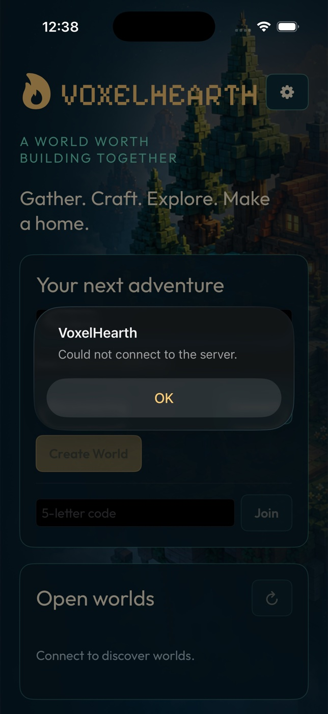

# VoxelHearth



An original multiplayer voxel sandbox with native **macOS**, **iPhone** and
**iPad** clients. SwiftUI provides the application and HUD, AppKit/UIKit handle
input, Metal renders the voxel world, and `URLSessionWebSocketTask` connects to
the existing authoritative Dart server. The client has no Flutter dependency.

## Play

- Deterministic 16×16×64 terrain, trees, caves, ores, water, daylight, fog,
  shadows, block lighting, animated water, block outlines and break progress.
- Configurable server/name; public room list; seeded room creation and code
  joining; survival/creative modes; ready status; host room rules, bot controls,
  start/end, results, rematch and return to lobby.
- Collision, jumping, sneaking at ledges, swimming, sprinting, creative flight,
  tools, harvesting, placing, food, creatures, combat, health, hunger, drowning,
  fall damage, death, respawn and sleeping through the night.
- Hotbar, stack transfers/splitting, dropping, 2×2 hand crafting, 3×3 workbench,
  recipe book, creative item palette, shared chests and kiln smelting.
- Room chat (200-character messages), remote player labels, particles, audio,
  touch haptics, pause and persisted settings. Resume tokens use Keychain.
- Server-authoritative rules, chunk edits, inventories, creatures, scores and
  results; native local movement prediction and snapshot interpolation.

Original artwork, procedural textures/item icons, key art, sound cues, app
icons, Outfit, Fraunces and Pixelify Sans fonts are retained. Font licenses live
beside the fonts in `apple/Resources/fonts/`. The original ink/navy, teal, gold
and cream visual palette remains the default.

## Quick start (macOS)

```sh
bash run.sh
```

This installs any missing prerequisites (Dart via Homebrew, the Metal
Toolchain), builds the macOS client, starts the server on port 8787 and
launches the app into a new room. `VH_NAME`, `VH_PORT` and `--no-build` are
supported; quitting the app stops the server. The manual steps follow.

## Requirements

- macOS with Xcode and its macOS/iOS SDKs, including the Metal toolchain.
  Targets deploy to **macOS 14+** and **iOS/iPadOS 17+**.
- Dart 3.9 or later for the server and shared rules. Tested with Dart 3.13.0.
- XcodeGen is optional: the generated Xcode project is checked in.
- No external Swift package downloads, CocoaPods or Flutter SDK are needed.

On a fresh machine, install the two pieces that do not ship with Xcode:

```sh
# Xcode 26 downloads the Metal compiler separately. Without it the build fails
# with "cannot execute tool 'metal' due to missing Metal Toolchain".
# The download is ~700 MB; retry if the catalog fetch fails the first time.
xcodebuild -downloadComponent MetalToolchain

brew install dart-sdk
```

## Server

```sh
cd server
dart pub get
dart run bin/server.dart --host 0.0.0.0 --port 8787 --save-dir data --seed 424242
```

The default native endpoint is `ws://127.0.0.1:8787/ws`. On a physical iPhone or
iPad, enter the server computer's LAN address in Settings and grant local
network access. Use `wss://` for an Internet-hosted TLS server. A server remains
necessary; clients do not replace authoritative multiplayer with local demos.

The server also exposes `/health` and `/rooms`. Add `--test-mode` only for
explicit client diagnostics; regular play and the protocol integration test
do not need it.

## Quick start

```sh
bash scripts/run-mac.sh          # installs the Metal toolchain and Dart if
                                 # missing, starts the server, builds and
                                 # launches the macOS app
bash scripts/run-mac.sh --doctor # prerequisite check only
bash scripts/run-mac.sh --ios    # additionally build the iOS Simulator target
```

If `xcodebuild` reports `iOS 26.x is not installed` although `xcrun simctl
list runtimes` shows the runtime, the installed Simulator runtime build differs
from the one this Xcode expects; run `xcodebuild -downloadPlatform iOS`.

## Native builds

Run these commands from this directory:

```sh
# Optional regeneration after editing project.yml
(cd apple && xcodegen generate)

xcodebuild -project apple/VoxelHearth.xcodeproj -scheme VoxelHearth-macOS \
  -destination 'platform=macOS' -derivedDataPath apple/DerivedData \
  CODE_SIGNING_ALLOWED=NO build

xcodebuild -project apple/VoxelHearth.xcodeproj -scheme VoxelHearth-iOS \
  -destination 'generic/platform=iOS Simulator' \
  -derivedDataPath apple/DerivedData CODE_SIGNING_ALLOWED=NO build

open apple/DerivedData/Build/Products/Debug/VoxelHearth.app
```

Alternatively open `apple/VoxelHearth.xcodeproj`, choose the macOS or iOS
scheme, and run. The iOS target supports device families **1 and 2**, portrait
and landscape. Choose an installed iPhone or iPad simulator for an interactive
run. Physical-device/distribution builds require your signing team.

The app has the retained `com.voxelhearth.voxelhearth` bundle ID, macOS outgoing
network entitlement, local-network description, and development ATS policy.
Both app schemes compile the Metal shader and embed the shared native package.

### Launch configuration

Set environment variables in Xcode's scheme Run configuration or run the
macOS executable directly:

```sh
VH_SERVER=ws://127.0.0.1:8787/ws VH_NAME=Alice VH_CREATE=1 \
  apple/DerivedData/Build/Products/Debug/VoxelHearth.app/Contents/MacOS/VoxelHearth
```

Arguments also work: `--server ws://host:8787/ws --name Alice --join ABCDEF`;
`--VH_SERVER=...` style names are accepted. Options:

| Option | Meaning |
|---|---|
| `VH_SERVER` | WebSocket endpoint; persisted in Settings |
| `VH_NAME` | Player name; persisted in Settings |
| `VH_JOIN` | Join this room after connection |
| `VH_CREATE=1` | Create a room after connection (join takes precedence) |
| `VH_TEST=1` | Enable server director diagnostics; new test sessions do not reuse/save Keychain tokens |

`VH_CREATE=1 VH_TEST=1` creates a creative test room with one bot. Diagnostic
`drive`/`hash_request` messages are accepted only when **both** the client flag
and server `--test-mode` are enabled. They operate on live game state: room and
game waits, camera/movement, inventory, chat, block actions, reconnect and state
hashes. Synthetic Flutter visual fixtures and screenshot layout drivers remain
historical and are not native parity checks.

Resume uses the last token for the configured endpoint, ordered sends, one
receive loop, one reconnect task and bounded backoff (eight attempts). Changing
servers clears local room state. Connection/protocol/Keychain/Metal failures
are presented in the app; Retry starts a fresh attempt.

### Controls

| Action | macOS / hardware keyboard | iPhone / iPad touch |
|---|---|---|
| Move | WASD / arrows | Left joystick |
| Look | Click viewport to capture, move mouse | Drag world |
| Jump / swim / fly up | Space | Hold Jump |
| Sneak / fly down | Shift | Hold Sneak |
| Sprint | Control | Hold Sprint |
| Mine / attack | Hold left mouse | Hold world or Break |
| Place / use / eat | Right mouse | Use |
| Hotbar | 1–9 / mouse wheel | Tap hotbar |
| Inventory | E | Inventory |
| Chat | T / Enter | Chat |
| Pause / release pointer | Escape | Pause |
| Creative flight | F | Fly |
| Drop one | Q | Inventory → Drop one |

Settings include FOV, look sensitivity, inverted Y, audio, haptics, FPS,
low/automatic/high rendering quality, appearance and touch controls. Automatic
quality adjusts render scale from observed frame rate. Native layouts scroll
or reflow at narrow sizes; reduced-motion preferences suppress HUD particles.

## Checks

```sh
# Native deterministic terrain, collision, protocol and registry checks
(cd apple/Core && swift test -c release)

# Starts/stops an isolated real Dart server and also runs the Swift WebSocket
# integration: two players, room settings, chat, movement, inventory,
# crafting/containers, token resume, results and rematch.
bash test/multiplayer-e2e.sh

# Native client preferences, input release and sneak collision tests
xcodebuild -project apple/VoxelHearth.xcodeproj -scheme VoxelHearth-macOS \
  -destination 'platform=macOS' -derivedDataPath apple/DerivedData \
  CODE_SIGNING_ALLOWED=NO test

swift format lint --strict --recursive apple/Sources apple/Tests \
  apple/Core/Sources apple/Core/Tests apple/Core/Package.swift

(cd packages/voxelhearth_core && dart pub get && dart analyze && dart test)
(cd server && dart pub get && dart analyze)
```

For a custom Dart executable, set `DART=/path/to/dart` when running the shell
integration. `VH_PORT` overrides its isolated port (default 18787). For an
existing backend, run `VH_INTEGRATION=ws://host:8787/ws swift test -c release
--filter BackendTests` from `apple/Core`. Without that variable the network test
explicitly skips. The Dart server has no separate `test/` directory; its
protocol behavior is exercised by the native integration suite.

Compile/protocol checks do **not** establish visual parity or device
performance. Interactive macOS/iPhone/iPad play, accessibility behavior and
physical-device performance still require a dedicated UI validation pass.

## Source and assets

```text
apple/
  VoxelHearth.xcodeproj/    checked-in iOS/macOS project and shared schemes
  project.yml              XcodeGen source
  Sources/                 SwiftUI, AppKit/UIKit, networking, gameplay and Metal
  Core/                    typed protocol, terrain, physics, registry and tests
  Tests/                   native client logic tests
  Resources/               textures, fonts/licenses, key art, icons and audio
server/                    unchanged authoritative Dart WebSocket backend
packages/voxelhearth_core/  unchanged shared Dart rules and tests
tools/                     deterministic asset/data generators
test/historical/           retired Flutter automation and widget evidence
PROTOCOL.md                existing wire contract
```

`dart tools/export_native.dart` regenerates atlas/tile bytes, registry/recipe
JSON and deterministic Dart terrain fixtures. `tools/gen_audio.py` uses Python's
standard library. `tools/gen_icons.py` uses Pillow to regenerate native icon
sets. The native shader is maintained directly in `apple/Sources/Voxel.metal`.

This project uses original assets and rules based on publicly documented voxel
sandbox mechanics. Its old four-platform Flutter reproduction records under
`.devin/clone-this/voxelhearth/` and `test/historical/` describe the retired
implementation, not current native build commands or native visual evidence.
