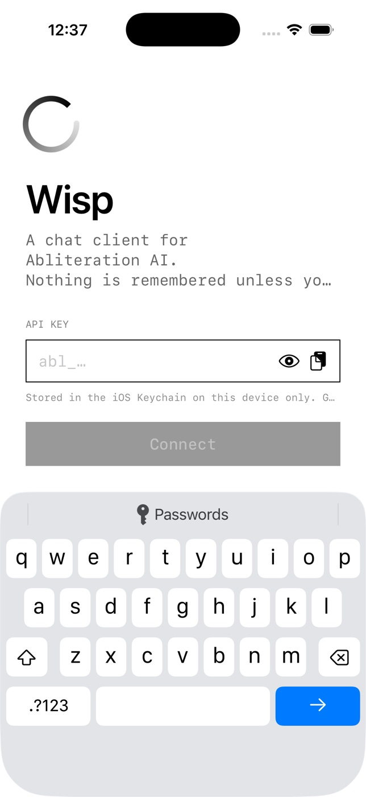

# Wisp



A native iOS (SwiftUI, iOS 17+) chat client for [Abliteration AI](https://abliteration.ai).
Black and white. Ephemeral by default.

## The idea

Most AI apps remember everything and make you delete. Wisp does the opposite:

- Every chat starts **ephemeral** — it lives in memory only and dissolves when you start a new one or close the app.
- Tap the bookmark to **keep** a chat. Only then is it written to disk (Application Support, file-protected). Un-bookmark and the file is deleted.
- "Keep new chats by default" is a setting, off by default.
- Unkept chats **burn after leaving**: once Wisp has been in the background for the chosen delay (now / 1 min / 5 min — the default / never), the transcript is gone when you return.
- The transcript is covered by a privacy shield in the app switcher, network traffic uses an ephemeral `URLSession` (no disk cache or cookies), and copies are device-local and expire from the clipboard after two minutes. A pasted API key is wiped from the clipboard once it's accepted.
- The API key is stored in the iOS Keychain and validated against `GET /v1/models` before it's accepted.

Because it's a bring-your-own-key app, the UI leans into that:

- Model switcher in the nav bar, populated live from `/v1/models` with context size and per-million pricing.
- Per-message and per-session token + cost meter, computed from the API's published pricing.
- Streaming with a blinking block cursor; the model's `reasoning` deltas stream into a collapsible "thinking" disclosure.
- Fenced code blocks render as monospaced, horizontally scrollable blocks with one-tap copy; long-press the last reply to regenerate.
- Stop mid-stream, retry on error, temperature and system prompt controls, light/dark/system appearance (always pure black on white or white on black — no greys, only opacity).

## Build & run

Requires Xcode 26 and [xcodegen](https://github.com/yonaskolb/XcodeGen) (`brew install xcodegen`).

```sh
cd wisp
xcodegen generate
xcodebuild -project Wisp.xcodeproj -scheme Wisp \
  -destination 'platform=iOS Simulator,name=iPhone 17 Pro' -derivedDataPath build build
xcrun simctl boot "iPhone 17 Pro"; open -a Simulator
xcrun simctl install booted build/Build/Products/Debug-iphonesimulator/Wisp.app
xcrun simctl launch booted dev.dabit.wisp
```

Paste an Abliteration API key on first launch. To paste into the simulator: `echo -n "$ABLITERATION_API_KEY" | xcrun simctl pbcopy booted`, then tap the clipboard button.

## Layout

```
Wisp/
  WispApp.swift            entry; swaps Onboarding <-> Chat on key presence
  Theme.swift              Paper/Ink colors, hairline borders, button style
  Models/Models.swift      ChatMessage, Conversation, ModelInfo (+pricing), Settings
  Services/
    KeychainStore.swift    API key storage
    AbliterationClient.swift  /v1/models + streaming /v1/chat/completions (SSE)
    ConversationStore.swift   JSON on disk, kept chats only
  ViewModels/
    AppState.swift         key, models, settings, current chat, kept list
    ChatController.swift   one streaming turn at a time
  Views/
    OnboardingView, ChatScreen, MessageList, Composer, HistoryView, SettingsView
```
